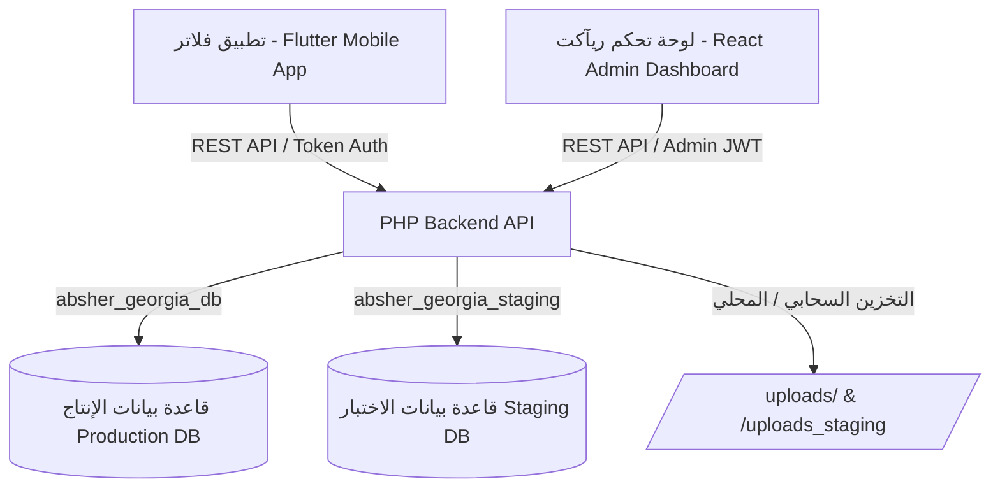

# دليل التسليم والتوثيق الشامل للمطورين (Developer Handover & Architecture Guide)
# منصة أبشر جورجيا (Absher Georgia Platform)

> **تنبيه هام للمطور القادم:**  
> هذا الدليل مرجع هندسي شامل يوثق بنية النظام بالكامل (الواجهات، الـ API، قواعد البيانات، والتطبيق). يُرجى قراءة هذا الملف بعناية فائقة قبل إجراء أي تعديل لتجنب كسر التوافق بين لوحة التحكم وتطبيق الهاتف وقواعد البيانات.

---

## 1. نظرة عامة على المشروع وهندسة النظام (Architecture Overview)

مشروع أبشر جورجيا يتكون من ثلاثة أركان رئيسية مترابطة:

1. **تطبيق الهاتف الذكي (Mobile App):** مبني بتقنية Flutter (Android & iOS).
2. **لوحة التحكم الذكية (Admin Dashboard):** مبنية بتقنية React 18 + TypeScript + Vite + CSS النقي المطور بتصميم عصري (Dark/Light Mode) وتدعم اللغتين العربية والإنجليزية.
3. **الواجهة الخلفية (Backend API):** مكتوبة بلغة PHP 8.1 (Native/Modular) متصلة بقواعد بيانات MySQL.



---

## 2. خريطة المستودع والمسارات (Project Structure)

```text
absher/
├── admin_react/                 # كود لوحة تحكم الإدارة (React + TS + Vite)
│   ├── src/
│   │   ├── components/          # المكونات (Modals, Forms, Charts, Cards)
│   │   ├── pages/               # الصفحات الرئيسية (Dashboard, PromoCodes, HousingOffers, etc.)
│   │   ├── context/             # إدارة الحالة (AuthContext, AdminContext, ThemeContext)
│   │   ├── services/            # استدعاءات API ومحولات البيانات
│   │   └── types/               # تعريفات TypeScript ونماذج البيانات
│   ├── .env.production          # إعدادات الإنتاج (VITE_BASE_PATH=/admin/, VITE_API_ROOT=/api)
│   ├── .env.staging             # إعدادات الستيجينج (VITE_BASE_PATH=/admin_v2/, VITE_API_ROOT=/api_staging)
│   └── package.json
│
├── backend_php/                 # الواجهة الخلفية وقواعد البيانات
│   ├── api/                     # مسارات الـ API للإنتاج (Production)
│   │   ├── admin_api.php        # المتحكم الرئيسي لجميع عمليات لوحة الإدارة
│   │   ├── student_requests.php # معالجة طلبات الطلاب، الخصومات، والاسترداد المالي
│   │   ├── services/            # خدمات الطلاب والتحقق من الأكواد
│   │   ├── offers/              # استعراض عروض السكن للطلاب
│   │   ├── upload/image.php     # رفع وضغط ومعالجة الصور
│   │   └── core/                # الدوال المركزية (Identity Block, Notifications, Env)
│   ├── api_staging/             # مسارات الـ API للستيجينج (معزولة بالكامل)
│   ├── config/                  # إعدادات الاتصال (db.php للإنتاج، db_staging.php للاختبار)
│   ├── uploads/                 # مجلد الصور المرفوعة للإنتاج
│   └── uploads_staging/         # مجلد صور الستيجينج
│
├── lib/                         # كود تطبيق Flutter
│   ├── core/                    # الثوابت، البيئة، الألوان والترجمة
│   ├── models/                  # نماذج البيانات (Student, Request, Offer, Promo)
│   ├── screens/                 # شاشات التطبيق
│   └── services/                # استدعاءات API والتخزين المحلي
│
├── docs/                        # وثائق التطوير ومخططات المراحل
│   ├── implementation_plan.md   # خطة التنفيذ المعتمدة للمراحل 1 إلى 7
│   └── DEVELOPER_HANDOVER.md    # هذا الملف
│
└── scratch/                     # سكربتات الاختبار والفحص التلقائي (مستبعدة من الـ Production Build)
```

---

## 3. بيئات العمل والروابط الحية (Environments & Live URLs)

السيرفر: Contabo Ubuntu 22.04 LTS (IP: `80.241.218.23` - Apache 2.4.52 - PHP 8.1 - MySQL 8.0).

| البيئة | رابط لوحة التحكم (Dashboard) | رابط الـ API | قاعدة البيانات | مجلد الصور |
| :--- | :--- | :--- | :--- | :--- |
| **Production (الإنتاج)** | `http://80.241.218.23/admin/` | `http://80.241.218.23/api/` | `absher_georgia_db` | `uploads/` |
| **Staging (الاختبار)** | `http://80.241.218.23/admin_v2/` | `http://80.241.218.23/api_staging/` | `absher_georgia_staging` | `uploads_staging/` |

> [!IMPORTANT]
> **عزل البيئات التام:**  
> يُمنع منعاً باتاً استدعاء ملفات الـ `staging` من بيئة الـ `production` أو العكس. تم ضبط كل بيئة لتعمل بشكل منفصل بقاعدتها ومجلداتها الخاصة.

---

## 4. الميزات المنجزة وقواعد العمل الأساسية (Core Modules & Business Logic)

### أ. لوحة الإدارة التنفيذية ومؤشرات الأداء (Executive Dashboard & 8 KPIs)
تحتوي لوحة الإدارة على شبكة تفاعلية تضم 8 بطاقات KPI محسوبة بدقة من الـ Backend:
1. **إجمالي الشقق** (`total_apartments`)
2. **إجمالي الخدمات** (`total_services`)
3. **إجمالي الطلاب المسجلين** (`total_students`)
4. **الجامعات المعتمدة** (`total_universities`)
5. **المناطق والأحياء** (`total_districts`)
6. **الطلبات قيد المراجعة** (`pending_requests`)
7. **أكواد الخصم النشطة** (`promo_codes_count`)
8. **عروض السكن النشطة (المؤشر الثامن)** (`active_housing_offers_count`):
   * يُحسب فقط للعروض النشطة (`is_active = 1`) والمرتبطة بشقق متاحة (`apartments.is_available = 1`) والتي يقع التاريخ الحالي ضمن فترتها الزمنية (`starts_at <= NOW < expires_at`).

### ب. نظام أكواد الخصم والمحفظة (Promo Codes & Wallet Discounts)
1. **قاعدة الدفع بالمحفظة حصراً:** الخصومات تنطبق **فقط** عند اختيار الدفع بنقاط المحفظة (`payment_method = 'wallet'`).
2. **منع الدفع النقدي مع الخصم:** محاولة استخدام كود خصم مع الدفع النقدي يتم رفضها بـ `HTTP 400` والرمز `PROMO_WALLET_ONLY`.
3. **دورة الاسترداد المالي (Refund State Machine):**
   * عند تقديم طلب خصم بالمحفظة: يتم خصم النقاط الصافية (`final_price_points`) وتسجيل سجل استرداد بحالة `applied` في جدول `promo_code_redemptions`.
   * عند إلغاء الطلب من قبل الإدارة أو الطالب: يتم استرداد النقاط تلقائياً للمحفظة مع حماية من التكرار عبر الفهرس الفريد المركب `uq_request_tx_type` على `(service_request_id, type)` في `wallet_transactions`.

### ج. نظام عروض السكن (Housing Offers)
1. يدعم رفع الصور الحقيقية مباشرة من لوحة التحكم أو الرابط الخارجي.
2. يدعم تحديد فترات زمنية للصلاحية (تاريخ البدء والانتهاء)، السعر الأصلي وسعر العرض والشارات الترويجية.
3. يدعم اللغتين العربية والإنجليزية بالحقول (`title_ar`, `title_en`, `description_ar`, `description_en`, `badge_text_ar`, `badge_text_en`).
4. عند حذف العرض، يتم حذف الصورة المخصصة من القرص تلقائياً إذا كانت مرفوعة محلياً داخل `uploads/housing_offers/`.

### د. رفع ومعالجة الصور (Image Upload & Optimization)
* نقطة النهاية: `POST /api/upload/image.php?folder={folder_name}`
* يتم ضغط الصور تلقائياً لأقصى بُعد 1920px مع الحفاظ على شفافية الـ PNG/WebP ودعم تحويلها وجودتها (85%).

---

## 5. تعليمات إلزامية لأي تعديل على الـ API ولوحة التحكم (Developer Rules)

> [!WARNING]
> **قاعدة التوافق ثلاثي الأبعاد (API ⟷ Dashboard ⟷ Mobile App):**  
> عند قيامك بتعديل أي Endpoint في ملف `admin_api.php` أو الـ API العام، يجب عليك الالتزام بالخطوات التالية:

### الخطوة 1: فحص وتحديث أنواع البيانات في React (TypeScript Types)
* توجه إلى المسار `admin_react/src/types/` أو واجهات الـ Context/Services.
* إذا قمت بتغيير اسم حقل أو إضافة حقل جديد (مثل `promo_codes_count` أو `active_housing_offers_count`):
  1. قم بتحديث الـ Interface المقابل له.
  2. تأكد من أن الـ Fallback مأخوذ بالاعتبار (`data?.stats?.promo_codes_count ?? 0`).

### الخطوة 2: اختبار الواجهة والأنواع (TypeScript & Lint Check)
قبل بناء أي كود للإدارة، شغّل دائماً:
```bash
cd admin_react
npm run typecheck
npm run lint
```
يجب ألا يكون هناك أي خطأ برمجي (0 errors).

### الخطوة 3: بناء لوحة التحكم للبيئة المناسبة (Build Command)
* لبناء الستيجينج: `npm run build:staging` (المخرجات في `dist/` مع مسار أساسي `/admin_v2/`).
* لبناء الإنتاج: `npm run build:production` (المخرجات في `dist/` مع مسار أساسي `/admin/`).

### الخطوة 4: التحقق من التطبيق (Flutter App)
إذا كان التعديل يمس واجهات الـ Student API:
1. حدّث النماذج المقابلة في `lib/models/`.
2. شغّل الفحص واختبارات الوحدة للتأكد من سلامة التطبيق:
```bash
flutter analyze
flutter test
```

---

## 6. إجراءات النشر اليدوي والآلي (Deployment Guide)

### أ. نشر الـ Backend (PHP)
1. ملفات الإنتاج توضع في: `/var/www/absher/backend_php/api/`
2. ملفات الستيجينج توضع في: `/var/www/absher/backend_php/api_staging/`
3. ضبط الصلاحيات دائماً:
```bash
chown -R www-data:www-data /var/www/absher/backend_php/
chmod -R 755 /var/www/absher/backend_php/api/
chmod -R 755 /var/www/absher/backend_php/uploads/
```

### ب. نشر لوحة التحكم (React Admin)
بعد عمل البناء على جهازك:
```bash
# لنشر الإنتاج (/admin/):
scp -r admin_react/dist/* root@80.241.218.23:/var/www/absher/backend_php/admin/
scp admin_react/public/.htaccess root@80.241.218.23:/var/www/absher/backend_php/admin/.htaccess

# لنشر الستيجينج (/admin_v2/):
scp -r admin_react/dist/* root@80.241.218.23:/var/www/absher/backend_php/admin_v2/
scp admin_react/public/.htaccess root@80.241.218.23:/var/www/absher/backend_php/admin_v2/.htaccess
```

> [!NOTE]
> تأكد دائماً من وجود ملف `.htaccess` داخل مجلدات الـ Admin لضمان عمل التوجيه الداخلي لـ React Router (Single Page Application) وعدم ظهور خطأ 404 عند تحديث الصفحة على مسار مثل `/admin/dashboard`.

---

## 7. فحص الجودة التلقائي (Automated Smoke Test Suite)

يتوفر في المستودع ملف فحص ذاتي شامل ومنظف لنفسه تلقائياً [scratch/smoke_test_prod.php](file:///c:/Users/moham/Desktop/absher/scratch/smoke_test_prod.php) لفحص سلامة الـ API، الإحصائيات، الأكواد، رفع الصور، وتأكيد سلامة أرصدة الطلاب 100%.

لتشغيله على السيرفر في أي وقت:
```bash
php /var/www/absher/scratch/smoke_test_prod.php
```

---

## 8. مسؤولية الصيانة والتواصل (Maintenance Notes)

* مستودع الـ Git الرئيسي: `https://github.com/mowaleed99/absher.git` (الفرع المعتمد: `main`).
* جميع الأكواد مفحوصة وخالية من أي أخطاء ترجمة (Clean Working Tree).
* يُرجى الالتزام بالـ Conventional Commits عند رفع أي تعديلات مستقبلية.
