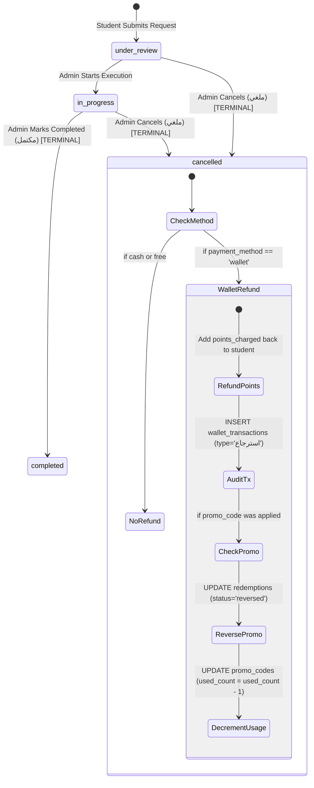

# Verified Phase 6A Master Implementation Plan — Promo Codes & Discounts

*(Authoritative Architecture, Cancellation & Refund State Machine, Concurrency Safeguards & Execution Roadmap)*

> **⛔ Status: PHASE 6A PLAN COMPLETE — WALLET-ONLY AND CANCELLATION POLICIES APPROVED — NO IMPLEMENTATION STARTED — WAITING FOR EXPLICIT USER GO**
> 
> | Phase | Description | Status |
> |---|---|---|
> | Phase 1 | Foundation, Auth, Apartments | `COMPLETED / VERIFIED / USER ACCEPTED ✅` |
> | Phase 2 | Districts & Universities | `COMPLETED / VERIFIED / USER ACCEPTED ✅` |
> | Phase 3 | Services & Service Requests | `COMPLETED / VERIFIED / USER ACCEPTED ✅` |
> | Phase 4 | Reviews Moderation, Feedback, Students & Points | `COMPLETED / VERIFIED / USER ACCEPTED ✅` |
> | Phase 5 | News, Notifications, Customer Support Chats | `COMPLETED / VERIFIED / USER ACCEPTED ✅` |
> | Phase 6 | Executive Dashboard & Cross-Module Analytics | `COMPLETED / VERIFIED / USER ACCEPTED ✅` |
> | **Phase 6A** | **Promo Codes & Discounts System** | **SPECIFICATION COMPLETE / APPROVED POLICIES** |
> | Deferred | Housing Offers (Waiting for User Requirements) | `DEFERRED / FROZEN` |
> | Cutover | Phase 7 / Production Promotion | `NOT STARTED — REQUIRES EXPLICIT USER GO` |

---

## 1. Approved Business Directives & Core Policies

### A. Wallet-Only Promo Code Directive
1. **Scope:** Promo codes apply **strictly and exclusively** to Wallet payments (`payment_method = 'wallet'`).
2. **No Cash Conversions:** No cash pricing model, currency conversions, or cash promo discounts exist in Phase 6A.
3. **Backend Enforcement:** Submitting a `promo_code` with `payment_method = 'cash'` is rejected with `HTTP 400 Bad Request` and `error_code: PROMO_WALLET_ONLY` (Arabic: `كود الخصم متاح عند الدفع بنقاط المحفظة فقط`, English: `Promo codes are available for wallet points payments only`).
4. **Flutter UI Rule:** The Promo Code input field is enabled only when "Wallet Points" is selected. Switching from Wallet to Cash immediately clears any applied promo code and resets the price breakdown.
5. **Zero Regression on Cash:** Cash requests submitted without promo codes continue operating unchanged.

---

## 2. Approved Cancellation and Automatic Refund State Machine



### A. Cancellation Authority & Parameters
- **Authority:** Authenticated Admin only (`AuthMiddleware::requireAdmin()`).
- **Identity:** Resolved strictly from Admin JWT session (`AuthMiddleware::$currentUserId`), never from client payload.
- **Mandatory Reason:** A non-empty string `cancellation_reason` (min 3 chars, max 255 chars) is mandatory.

### B. Allowed Status Transitions (Authoritative Arabic Database Values)
- Real Database Statuses: `قيد المراجعة` (Under Review / New), `قيد التنفيذ` (In Progress), `مكتمل` (Completed), `ملغي` (Cancelled).
- **Valid Transition:** Any non-completed status (`قيد المراجعة`, `قيد التنفيذ`, `pending_cash`) may transition to `ملغي`.
- **Prohibited Transition:** Completed requests (`مكتمل`) **cannot** be cancelled. Rejected with `HTTP 400 Bad Request` (`CANNOT_CANCEL_COMPLETED_REQUEST`).
- **Terminal State:** A cancelled request (`ملغي`) cannot be transitioned to any other status.
- **Idempotency:** Calling cancel on an already cancelled request returns `HTTP 200 OK` without duplicating financial refunds or usage decrements.

### C. Automatic Wallet Refund & Promo Reversal Rules
1. **Wallet Points Refund:**
   - Refund amount = stored `service_requests.points_charged` (authoritative historical charged amount, immune to subsequent service edits).
   - If `points_charged > 0`: Add `points_charged` to student wallet (`students.points = students.points + points_charged`).
   - Insert exactly one refund audit row in `wallet_transactions` (`type = 'استرجاع'`, `amount = points_charged`, `service_request_id = request.id`).
   - If `points_charged = 0` (e.g. Free promo code or 0-point service): No wallet transaction row is created.
2. **Promo Redemption Reversal:**
   - If the request has an active redemption (`status = 'applied'`):
     - Transition redemption to `status = 'reversed'`, `reversed_at = NOW()`, `reversed_reason = cancellation_reason`.
     - Decrement `promo_codes.used_count = used_count - 1` **only if** the redemption transition affected exactly 1 row.
     - Reversed redemptions are excluded from both total usage limits and per-student usage limits. The student may reuse the code if eligible.
3. **Cash Orders:** 0 points charged -> 0 points refunded. No wallet transactions or promo reversals occur.

### D. Duplicate-Refund Protection (Database Unique Constraint)
- Audit of `wallet_transactions` showed `uniq_service_request_id` directly on `service_request_id`.
- Staged migration replaces this index with a composite unique index: `UNIQUE KEY uq_request_tx_type (service_request_id, type)`.
- **Guarantee:** Allows exactly 1 deduction (`type = 'خصم'`) and exactly 1 refund (`type = 'استرجاع'`) per request. Concurrent or repeated cancellation calls are physically blocked at the database engine level from creating duplicate refunds.

### E. Atomic Lock Ordering & Execution Sequence
Inside a single MySQL transaction (`$conn->beginTransaction()`):
1. **Lock Request:** `SELECT * FROM service_requests WHERE id = ? FOR UPDATE`
2. **Status Guard:** If `status === 'مكتمل'`, throw `Cannot cancel completed request`. If `status === 'ملغي'`, return cached success (clean exit).
3. **Lock Redemption (if exists):** `SELECT * FROM promo_code_redemptions WHERE service_request_id = ? AND status = 'applied' FOR UPDATE`
4. **Lock Promo Code (if exists):** `SELECT * FROM promo_codes WHERE id = ? FOR UPDATE`
5. **Lock Student Wallet (if `points_charged > 0`):** `SELECT points FROM students WHERE id = ? FOR UPDATE`
6. **Refund Student Wallet:** `UPDATE students SET points = points + ? WHERE id = ?`
7. **Insert Refund Transaction:** `INSERT INTO wallet_transactions (student_id, service_request_id, amount, type, description, created_at) VALUES (?, ?, ?, 'استرجاع', ?, NOW())`
8. **Reverse Promo Redemption:** `UPDATE promo_code_redemptions SET status = 'reversed', reversed_at = NOW(), reversed_reason = ? WHERE id = ? AND status = 'applied'`
9. **Decrement Promo Usage:** If redemption updated, `UPDATE promo_codes SET used_count = used_count - 1 WHERE id = ?`
10. **Record Cancellation Audit on Request:** `UPDATE service_requests SET status = 'ملغي', cancelled_at = NOW(), cancelled_by_admin_id = ?, cancellation_reason = ?, refund_status = ? WHERE id = ?`
11. **Dispatch Bilingual Push Notification:** Send cancellation notice to student (`cancelled_request_notif`).
12. **Commit Transaction.**

---

## 3. Verified Current-State Codebase & Database Audit

### A. Flutter Mobile Request Flow
- **Form Screen:** [`lib/screens/services_screen.dart`](file:///c:/Users/moham/Desktop/absher/lib/screens/services_screen.dart#L180-L710)
  - Line 189: `final promoCtrl = TextEditingController();`
  - Lines 481–490: Static unvalidated text field.
  - Lines 642–657: Free-text bracket concatenation (`[كود الخصم: XYZ]`).
  - Lines 690–705: `ApiService.submitServiceRequest` does not send discrete promo code.

### B. Mobile API Service Layer
- **File:** [`lib/services/api_service.dart`](file:///c:/Users/moham/Desktop/absher/lib/services/api_service.dart#L523-L576)
  - Accepts `submitServiceRequest` parameters without discrete promo code field.

### C. Backend Request Reception & Pricing
- **File:** [`backend_php/api_staging/student_requests.php`](file:///c:/Users/moham/Desktop/absher/backend_php/api_staging/student_requests.php#L285-L475)
  - Line 293: Resolves service price strictly from `services.price_points`.
  - Line 352: `SELECT points FROM students WHERE id = ? FOR UPDATE` locks student balance.
  - Line 364: Deducts 100% of points via `UPDATE students SET points = points - ? WHERE id = ? AND points >= ?`.
  - Line 375: Inserts into `service_requests`.
  - Line 383: Inserts deduction row into `wallet_transactions`.

### D. Existing Admin Delete Behavior & Foreign Key Resolution
- **File:** [`backend_php/api_staging/admin_api.php`](file:///c:/Users/moham/Desktop/absher/backend_php/api_staging/admin_api.php#L519-L900)
  - Hard delete exists on `students` (`DELETE FROM students WHERE id = ?`) and `services` (`DELETE FROM services WHERE id = ?`).
  - **Resolution:** `promo_code_redemptions` uses `ON DELETE SET NULL` on `student_id`, `service_id`, and `service_request_id` while storing permanent snapshot strings (`student_name_snapshot`, `student_phone_snapshot`, `student_email_snapshot`, `service_title_snapshot`, `request_id_snapshot`). Deletion of students or services will never trigger FK constraint errors.

---

## 4. Database Schema & Safe Staged Migration Plan

### Staged Migration Script: `sql/migrations/2026_08_phase6a_promo_codes.sql`

```sql
-- Migration: Phase 6A Promo Codes, Discounts & Cancellation Refunds
-- Target: absher_georgia_staging ONLY (Production isolated)

SET @dbname = DATABASE();

-- 1. Main Promo Codes Table
CREATE TABLE IF NOT EXISTS `promo_codes` (
  `id` INT AUTO_INCREMENT PRIMARY KEY,
  `campaign_name` VARCHAR(255) NOT NULL,
  `code` VARCHAR(50) COLLATE utf8mb4_bin NOT NULL,
  `discount_type` ENUM('percentage', 'fixed', 'free') NOT NULL,
  `discount_value` DECIMAL(10, 2) NOT NULL DEFAULT 0.00,
  `max_discount_points` INT NULL DEFAULT NULL,
  `min_service_price_points` INT NOT NULL DEFAULT 0,
  `start_at` DATETIME NULL DEFAULT NULL,
  `expires_at` DATETIME NULL DEFAULT NULL,
  `status` ENUM('active', 'paused', 'archived') NOT NULL DEFAULT 'active',
  `service_scope` ENUM('all', 'selected') NOT NULL DEFAULT 'all',
  `audience_scope` ENUM('all', 'selected') NOT NULL DEFAULT 'all',
  `total_usage_limit` INT NULL DEFAULT NULL,
  `per_student_limit` INT NOT NULL DEFAULT 1,
  `used_count` INT NOT NULL DEFAULT 0,
  `created_at` DATETIME DEFAULT CURRENT_TIMESTAMP,
  `updated_at` DATETIME DEFAULT CURRENT_TIMESTAMP ON UPDATE CURRENT_TIMESTAMP,
  UNIQUE KEY `uq_promo_code` (`code`),
  INDEX `idx_promo_status_dates` (`status`, `start_at`, `expires_at`)
) ENGINE=InnoDB DEFAULT CHARSET=utf8mb4 COLLATE=utf8mb4_unicode_ci;

-- 2. Promo Code Service Eligibility Junction Table
CREATE TABLE IF NOT EXISTS `promo_code_services` (
  `id` INT AUTO_INCREMENT PRIMARY KEY,
  `promo_code_id` INT NOT NULL,
  `service_id` INT NOT NULL,
  `created_at` DATETIME DEFAULT CURRENT_TIMESTAMP,
  UNIQUE KEY `uq_promo_service` (`promo_code_id`, `service_id`),
  CONSTRAINT `fk_pcs_promo` FOREIGN KEY (`promo_code_id`) REFERENCES `promo_codes` (`id`) ON DELETE CASCADE,
  CONSTRAINT `fk_pcs_service` FOREIGN KEY (`service_id`) REFERENCES `services` (`id`) ON DELETE CASCADE
) ENGINE=InnoDB DEFAULT CHARSET=utf8mb4 COLLATE=utf8mb4_unicode_ci;

-- 3. Promo Code Student Audience Junction Table
CREATE TABLE IF NOT EXISTS `promo_code_students` (
  `id` INT AUTO_INCREMENT PRIMARY KEY,
  `promo_code_id` INT NOT NULL,
  `student_id` INT NOT NULL,
  `created_at` DATETIME DEFAULT CURRENT_TIMESTAMP,
  UNIQUE KEY `uq_promo_student` (`promo_code_id`, `student_id`),
  CONSTRAINT `fk_pcst_promo` FOREIGN KEY (`promo_code_id`) REFERENCES `promo_codes` (`id`) ON DELETE CASCADE,
  CONSTRAINT `fk_pcst_student` FOREIGN KEY (`student_id`) REFERENCES `students` (`id`) ON DELETE CASCADE
) ENGINE=InnoDB DEFAULT CHARSET=utf8mb4 COLLATE=utf8mb4_unicode_ci;

-- 4. Immutable Redemption History Table (Deletion-Safe Audit Trail)
CREATE TABLE IF NOT EXISTS `promo_code_redemptions` (
  `id` INT AUTO_INCREMENT PRIMARY KEY,
  `promo_code_id` INT NOT NULL,
  `service_request_id` INT NULL,
  `request_id_snapshot` INT NOT NULL,
  `student_id` INT NULL,
  `student_name_snapshot` VARCHAR(150) NOT NULL,
  `student_phone_snapshot` VARCHAR(50) NOT NULL,
  `student_email_snapshot` VARCHAR(150) NOT NULL,
  `service_id` INT NULL,
  `service_title_snapshot` VARCHAR(200) NOT NULL,
  `code_snapshot` VARCHAR(50) NOT NULL,
  `campaign_snapshot` VARCHAR(255) NOT NULL,
  `discount_type_snapshot` VARCHAR(20) NOT NULL,
  `discount_value_snapshot` DECIMAL(10, 2) NOT NULL,
  `original_price_points` INT NOT NULL,
  `discount_points` INT NOT NULL,
  `final_price_points` INT NOT NULL,
  `payment_method` VARCHAR(30) NOT NULL DEFAULT 'wallet',
  `status` ENUM('applied', 'reversed') NOT NULL DEFAULT 'applied',
  `reversed_at` DATETIME NULL DEFAULT NULL,
  `reversed_reason` VARCHAR(255) NULL DEFAULT NULL,
  `created_at` DATETIME DEFAULT CURRENT_TIMESTAMP,
  UNIQUE KEY `uq_redemption_request` (`service_request_id`),
  INDEX `idx_redemption_promo_student` (`promo_code_id`, `student_id`),
  INDEX `idx_redemption_student` (`student_id`, `created_at`),
  CONSTRAINT `fk_pcr_promo` FOREIGN KEY (`promo_code_id`) REFERENCES `promo_codes` (`id`) ON DELETE RESTRICT,
  CONSTRAINT `fk_pcr_request` FOREIGN KEY (`service_request_id`) REFERENCES `service_requests` (`id`) ON DELETE SET NULL,
  CONSTRAINT `fk_pcr_student` FOREIGN KEY (`student_id`) REFERENCES `students` (`id`) ON DELETE SET NULL,
  CONSTRAINT `fk_pcr_service` FOREIGN KEY (`service_id`) REFERENCES `services` (`id`) ON DELETE SET NULL
) ENGINE=InnoDB DEFAULT CHARSET=utf8mb4 COLLATE=utf8mb4_unicode_ci;

-- 5. Staged Extension of service_requests Table
-- Step 5a: Add columns as nullable first
SET @col1 = (SELECT COUNT(*) FROM information_schema.COLUMNS WHERE TABLE_SCHEMA = @dbname AND TABLE_NAME = 'service_requests' AND COLUMN_NAME = 'promo_code_id');
SET @sql1 = IF(@col1 = 0, 'ALTER TABLE service_requests ADD COLUMN promo_code_id INT NULL AFTER service_id', 'SELECT 1');
PREPARE stmt1 FROM @sql1; EXECUTE stmt1; DEALLOCATE PREPARE stmt1;

SET @col2 = (SELECT COUNT(*) FROM information_schema.COLUMNS WHERE TABLE_SCHEMA = @dbname AND TABLE_NAME = 'service_requests' AND COLUMN_NAME = 'discount_points');
SET @sql2 = IF(@col2 = 0, 'ALTER TABLE service_requests ADD COLUMN discount_points INT NULL AFTER service_price_points', 'SELECT 1');
PREPARE stmt2 FROM @sql2; EXECUTE stmt2; DEALLOCATE PREPARE stmt2;

SET @col3 = (SELECT COUNT(*) FROM information_schema.COLUMNS WHERE TABLE_SCHEMA = @dbname AND TABLE_NAME = 'service_requests' AND COLUMN_NAME = 'final_price_points');
SET @sql3 = IF(@col3 = 0, 'ALTER TABLE service_requests ADD COLUMN final_price_points INT NULL AFTER discount_points', 'SELECT 1');
PREPARE stmt3 FROM @sql3; EXECUTE stmt3; DEALLOCATE PREPARE stmt3;

SET @col4 = (SELECT COUNT(*) FROM information_schema.COLUMNS WHERE TABLE_SCHEMA = @dbname AND TABLE_NAME = 'service_requests' AND COLUMN_NAME = 'cancelled_at');
SET @sql4 = IF(@col4 = 0, 'ALTER TABLE service_requests ADD COLUMN cancelled_at DATETIME NULL AFTER status', 'SELECT 1');
PREPARE stmt4 FROM @sql4; EXECUTE stmt4; DEALLOCATE PREPARE stmt4;

SET @col5 = (SELECT COUNT(*) FROM information_schema.COLUMNS WHERE TABLE_SCHEMA = @dbname AND TABLE_NAME = 'service_requests' AND COLUMN_NAME = 'cancelled_by_admin_id');
SET @sql5 = IF(@col5 = 0, 'ALTER TABLE service_requests ADD COLUMN cancelled_by_admin_id INT NULL AFTER cancelled_at', 'SELECT 1');
PREPARE stmt5 FROM @sql5; EXECUTE stmt5; DEALLOCATE PREPARE stmt5;

SET @col6 = (SELECT COUNT(*) FROM information_schema.COLUMNS WHERE TABLE_SCHEMA = @dbname AND TABLE_NAME = 'service_requests' AND COLUMN_NAME = 'cancellation_reason');
SET @sql6 = IF(@col6 = 0, 'ALTER TABLE service_requests ADD COLUMN cancellation_reason VARCHAR(255) NULL AFTER cancelled_by_admin_id', 'SELECT 1');
PREPARE stmt6 FROM @sql6; EXECUTE stmt6; DEALLOCATE PREPARE stmt6;

SET @col7 = (SELECT COUNT(*) FROM information_schema.COLUMNS WHERE TABLE_SCHEMA = @dbname AND TABLE_NAME = 'service_requests' AND COLUMN_NAME = 'refund_status');
SET @sql7 = IF(@col7 = 0, 'ALTER TABLE service_requests ADD COLUMN refund_status ENUM(\'none\', \'refunded\', \'not_applicable\') NOT NULL DEFAULT \'none\' AFTER cancellation_reason', 'SELECT 1');
PREPARE stmt7 FROM @sql7; EXECUTE stmt7; DEALLOCATE PREPARE stmt7;

-- Step 5b: Backfill legacy historical rows accurately
UPDATE service_requests 
SET discount_points = 0,
    final_price_points = COALESCE(points_charged, service_price_points, 0)
WHERE final_price_points IS NULL AND payment_method = 'wallet';

UPDATE service_requests 
SET discount_points = 0,
    final_price_points = 0
WHERE final_price_points IS NULL;

-- Step 5c: Apply NOT NULL constraints and foreign keys safely
ALTER TABLE `service_requests`
  MODIFY COLUMN `discount_points` INT NOT NULL DEFAULT 0,
  MODIFY COLUMN `final_price_points` INT NOT NULL DEFAULT 0;

SET @fk_exists = (SELECT COUNT(*) FROM information_schema.TABLE_CONSTRAINTS WHERE TABLE_SCHEMA = @dbname AND TABLE_NAME = 'service_requests' AND CONSTRAINT_NAME = 'fk_sr_promo');
SET @sql_fk = IF(@fk_exists = 0, 'ALTER TABLE service_requests ADD CONSTRAINT fk_sr_promo FOREIGN KEY (promo_code_id) REFERENCES promo_codes (id) ON DELETE SET NULL', 'SELECT 1');
PREPARE stmt_fk FROM @sql_fk; EXECUTE stmt_fk; DEALLOCATE PREPARE stmt_fk;

SET @fk_admin = (SELECT COUNT(*) FROM information_schema.TABLE_CONSTRAINTS WHERE TABLE_SCHEMA = @dbname AND TABLE_NAME = 'service_requests' AND CONSTRAINT_NAME = 'fk_sr_admin_cancel');
SET @sql_admin = IF(@fk_admin = 0, 'ALTER TABLE service_requests ADD CONSTRAINT fk_sr_admin_cancel FOREIGN KEY (cancelled_by_admin_id) REFERENCES admins (id) ON DELETE SET NULL', 'SELECT 1');
PREPARE stmt_admin FROM @sql_admin; EXECUTE stmt_admin; DEALLOCATE PREPARE stmt_admin;

-- 6. Upgrade wallet_transactions Unique Index for Duplicate Refund Protection
-- Replaces single-column uniq_service_request_id with (service_request_id, type)
SET @old_idx = (SELECT COUNT(*) FROM information_schema.STATISTICS WHERE TABLE_SCHEMA = @dbname AND TABLE_NAME = 'wallet_transactions' AND INDEX_NAME = 'uniq_service_request_id');
SET @sql_drop = IF(@old_idx > 0, 'ALTER TABLE wallet_transactions DROP INDEX uniq_service_request_id', 'SELECT 1');
PREPARE stmt_drop FROM @sql_drop; EXECUTE stmt_drop; DEALLOCATE PREPARE stmt_drop;

SET @new_idx = (SELECT COUNT(*) FROM information_schema.STATISTICS WHERE TABLE_SCHEMA = @dbname AND TABLE_NAME = 'wallet_transactions' AND INDEX_NAME = 'uq_request_tx_type');
SET @sql_add = IF(@new_idx = 0, 'ALTER TABLE wallet_transactions ADD UNIQUE KEY uq_request_tx_type (service_request_id, type)', 'SELECT 1');
PREPARE stmt_add FROM @sql_add; EXECUTE stmt_add; DEALLOCATE PREPARE stmt_add;
```

---

## 5. Exact Discount Arithmetic & Normalization

1. **Normalization:** `trim(strtoupper($code))`, validated against `/^[A-Z0-9_-]{3,50}$/`.
2. **Percentage Discount (`percentage`):**
   - Value: `1 <= discount_value <= 100`.
   - Formula: `$discountPoints = (int)floor($originalPricePoints * ($discountValue / 100.0))`.
   - Max Cap: If `$maxDiscountPoints > 0`, `$discountPoints = min($discountPoints, $maxDiscountPoints)`.
   - Final Price: `$finalPricePoints = max(0, $originalPricePoints - $discountPoints)`.
3. **Fixed Discount (`fixed`):**
   - Value: `1 <= discount_value <= 100000`.
   - Formula: `$discountPoints = min((int)$discountValue, $originalPricePoints)`.
   - Final Price: `$finalPricePoints = max(0, $originalPricePoints - $discountPoints)`.
4. **Free Code (`free`):**
   - Formula: `$discountPoints = $originalPricePoints`, `$finalPricePoints = 0`.
5. **Zero-value discounts are strictly disallowed.**

---

## 6. Strict API Contracts & Error Protocols

### A. Student Validation: `POST /api_staging/services/validate_promo.php`
- **Authentication:** **Bearer JWT strictly required**. Unauthenticated -> `HTTP 401 Unauthorized`.
- **Payload:** `{ "code": "SUMMER20", "service_id": 3, "payment_method": "wallet" }`
- **Success (HTTP 200):**
  ```json
  {
    "status": "success",
    "data": {
      "is_valid": true,
      "promo_code_id": 4,
      "code": "SUMMER20",
      "campaign_name": "خصم الصيف للطلاب",
      "discount_type": "percentage",
      "discount_value": 20.0,
      "original_price": 100,
      "discount_points": 20,
      "final_price": 80,
      "message": "تم تطبيق كود الخصم بنجاح (-20 نقطة)"
    }
  }
  ```
- **Error Codes (HTTP 400 / 401 / 403):**
  - `UNAUTHORIZED` (401)
  - `PROMO_WALLET_ONLY` (400)
  - `INVALID_CODE` (400)
  - `DISABLED` (400)
  - `NOT_STARTED` (400)
  - `EXPIRED` (400)
  - `TOTAL_LIMIT_REACHED` (400)
  - `STUDENT_LIMIT_REACHED` (400)
  - `SERVICE_NOT_ELIGIBLE` (400)
  - `MIN_PRICE_NOT_MET` (400)
  - `ACCOUNT_BLOCKED` (403)

### B. Student Request Submission: `POST /api_staging/student_requests.php` (action=submit)
- Atomic transaction revalidates promo code, locks student wallet, deducts `final_price_points`, inserts `service_requests` row, inserts `promo_code_redemptions` row, inserts `wallet_transactions` row (`type = 'خصم'`).

### C. Admin Request Status Update: `POST /api_staging/admin_api.php?action=update_request_status`
- **Payload:** `{ "id": 12, "status": "ملغي", "cancellation_reason": "طلب غير متوفر حالياً" }`
- **Success Response (HTTP 200):**
  ```json
  {
    "status": "success",
    "message": "تم إلغاء الطلب واسترجاع النقاط للمحفظة بنجاح",
    "data": {
      "id": 12,
      "status": "ملغي",
      "points_refunded": 80,
      "promo_reversed": true,
      "refund_status": "refunded"
    }
  }
  ```

---

## 7. Executive Dashboard Integration

- **Backend API:** [`backend_php/api_staging/admin/dashboard.php`](file:///c:/Users/moham/Desktop/absher/backend_php/api_staging/admin/dashboard.php)
  - Lightweight summary query:
    ```sql
    SELECT 
      (SELECT COUNT(*) FROM promo_codes WHERE status = 'active') AS active_promos,
      (SELECT COUNT(*) FROM promo_code_redemptions WHERE status = 'applied') AS total_redemptions,
      (SELECT COALESCE(SUM(discount_points), 0) FROM promo_code_redemptions WHERE status = 'applied') AS total_points_saved;
    ```
- **React Frontend:**
  - Update [`admin_react/src/types/dashboard.ts`](file:///c:/Users/moham/Desktop/absher/admin_react/src/types/dashboard.ts).
  - Update [`admin_react/src/hooks/useDashboardStats.ts`](file:///c:/Users/moham/Desktop/absher/admin_react/src/hooks/useDashboardStats.ts).
  - Update [`admin_react/src/modules/dashboard/DashboardModule.tsx`](file:///c:/Users/moham/Desktop/absher/admin_react/src/modules/dashboard/DashboardModule.tsx).

---

## 8. Complete List of Files to Create and Modify

### Database:
- `[NEW]` [`sql/migrations/2026_08_phase6a_promo_codes.sql`](file:///c:/Users/moham/Desktop/absher/sql/migrations/2026_08_phase6a_promo_codes.sql)

### Backend PHP:
- `[NEW]` [`backend_php/api_staging/services/validate_promo.php`](file:///c:/Users/moham/Desktop/absher/backend_php/api_staging/services/validate_promo.php)
- `[MODIFY]` [`backend_php/api_staging/student_requests.php`](file:///c:/Users/moham/Desktop/absher/backend_php/api_staging/student_requests.php)
- `[MODIFY]` [`backend_php/api_staging/admin_api.php`](file:///c:/Users/moham/Desktop/absher/backend_php/api_staging/admin_api.php)
- `[MODIFY]` [`backend_php/api_staging/admin/dashboard.php`](file:///c:/Users/moham/Desktop/absher/backend_php/api_staging/admin/dashboard.php)

### Admin React Dashboard:
- `[NEW]` [`admin_react/src/types/promo.ts`](file:///c:/Users/moham/Desktop/absher/admin_react/src/types/promo.ts)
- `[NEW]` [`admin_react/src/hooks/usePromoCodes.ts`](file:///c:/Users/moham/Desktop/absher/admin_react/src/hooks/usePromoCodes.ts)
- `[NEW]` [`admin_react/src/modules/promo/PromoCodesModule.tsx`](file:///c:/Users/moham/Desktop/absher/admin_react/src/modules/promo/PromoCodesModule.tsx)
- `[NEW]` [`admin_react/src/modules/promo/AddPromoCodeModal.tsx`](file:///c:/Users/moham/Desktop/absher/admin_react/src/modules/promo/AddPromoCodeModal.tsx)
- `[NEW]` [`admin_react/src/modules/promo/EditPromoCodeModal.tsx`](file:///c:/Users/moham/Desktop/absher/admin_react/src/modules/promo/EditPromoCodeModal.tsx)
- `[NEW]` [`admin_react/src/modules/promo/PromoDetailsModal.tsx`](file:///c:/Users/moham/Desktop/absher/admin_react/src/modules/promo/PromoDetailsModal.tsx)
- `[MODIFY]` [`admin_react/src/modules/requests/RequestDetailsModal.tsx`](file:///c:/Users/moham/Desktop/absher/admin_react/src/modules/requests/RequestDetailsModal.tsx) (cancellation confirmation modal & reason input)
- `[MODIFY]` [`admin_react/src/types/dashboard.ts`](file:///c:/Users/moham/Desktop/absher/admin_react/src/types/dashboard.ts)
- `[MODIFY]` [`admin_react/src/hooks/useDashboardStats.ts`](file:///c:/Users/moham/Desktop/absher/admin_react/src/hooks/useDashboardStats.ts)
- `[MODIFY]` [`admin_react/src/modules/dashboard/DashboardModule.tsx`](file:///c:/Users/moham/Desktop/absher/admin_react/src/modules/dashboard/DashboardModule.tsx)
- `[MODIFY]` [`admin_react/src/App.tsx`](file:///c:/Users/moham/Desktop/absher/admin_react/src/App.tsx)
- `[MODIFY]` [`admin_react/src/layouts/AdminLayout.tsx`](file:///c:/Users/moham/Desktop/absher/admin_react/src/layouts/AdminLayout.tsx)
- `[MODIFY]` [`admin_react/src/lib/i18n.tsx`](file:///c:/Users/moham/Desktop/absher/admin_react/src/lib/i18n.tsx)
- `[MODIFY]` [`admin_react/src/lib/validators.ts`](file:///c:/Users/moham/Desktop/absher/admin_react/src/lib/validators.ts)

### Flutter Mobile App:
- `[MODIFY]` [`lib/services/api_service.dart`](file:///c:/Users/moham/Desktop/absher/lib/services/api_service.dart)
- `[MODIFY]` [`lib/screens/services_screen.dart`](file:///c:/Users/moham/Desktop/absher/lib/screens/services_screen.dart)
- `[MODIFY]` [`lib/services/language_service.dart`](file:///c:/Users/moham/Desktop/absher/lib/services/language_service.dart)

---

## 9. Exact Phase 6A Execution Order

1. **Step 1: Database Migration & Schema Staging**
   - Apply staged migration to `absher_georgia_staging`.
   - Verify table structure and indexes.
2. **Step 2: Backend API Implementation**
   - Create `validate_promo.php` with JWT enforcement.
   - Update `student_requests.php` for atomic promo deduction.
   - Update `admin_api.php` for promo CRUD and cancellation/refund state machine.
   - Update `admin/dashboard.php` for promo summary stats.
3. **Step 3: Automated Backend Verification**
   - Run automated verification suite on VPS Staging.
4. **Step 4: React Admin Implementation**
   - Create types, hooks, and modals in `src/modules/promo/`.
   - Add cancellation confirmation UI in `RequestDetailsModal.tsx`.
   - Add `/promo-codes` route and Sidebar entry.
   - Integrate Promo KPI on Executive Dashboard.
   - Build production bundle (`npm run build`).
5. **Step 5: Flutter App Integration**
   - Update `api_service.dart` with `validatePromoCode`.
   - Redesign Promo Code section in `services_screen.dart` with reactive breakdown and wallet-only enforcement.
6. **Step 6: Deploy & End-to-End Staging Verification**
   - Deploy bundle to `/admin_v2/` on VPS.
   - Run full automated regression matrix.
7. **Step 7: Manual User Acceptance Testing (UAT)**
   - Execute manual test checklist.
8. **Step 8: Stop Point**
   - Record user acceptance and await explicit command for Phase 7 (Cutover).

---

## 10. Manual User UAT Checklist

- [ ] **Admin Promo Creation:** Create percentage (20%), fixed (30 pts), and free promo codes. Verify code normalization to uppercase.
- [ ] **Flutter Live Validation:** Enter code, click Apply, verify instant visual price breakdown (Original -> Discount -> Final).
- [ ] **Wallet-Only Enforcement:** Switch to Cash payment; verify promo code input is disabled/cleared.
- [ ] **Student Request Submission:** Submit request with promo code; verify student wallet points deducted by exactly `final_price_points`.
- [ ] **Admin Request Management:** Open request in Admin Dashboard; verify discount breakdown pill.
- [ ] **Admin Cancellation & Refund:** Change status to `ملغي`; enter mandatory cancellation reason; verify student wallet points automatically refunded.
- [ ] **Promo Reversal:** Verify promo `used_count` decrements by 1; verify student can reuse code if eligible.
- [ ] **Dashboard KPI Verification:** Verify Executive Dashboard promo cards update in real time.

---

## 11. Staging Fixtures, Rollback & Backward Compatibility Plans

### A. Staging Seed Fixtures
```sql
-- Fixture 1: 20% Percentage Discount Code
INSERT INTO promo_codes (campaign_name, code, discount_type, discount_value, max_discount_points, min_service_price_points, status, used_count)
VALUES ('خصم ترحيبي 20%', 'WELCOME20', 'percentage', 20.00, 50, 0, 'active', 0);

-- Fixture 2: 25 Points Fixed Discount Code
INSERT INTO promo_codes (campaign_name, code, discount_type, discount_value, min_service_price_points, status, used_count)
VALUES ('خصم صيانة 25 نقطة', 'FIXED25', 'fixed', 25.00, 50, 'active', 0);

-- Fixture 3: Free Service Code
INSERT INTO promo_codes (campaign_name, code, discount_type, discount_value, status, used_count)
VALUES ('خدمة مجانية للطلاب الجدد', 'FREEPASS', 'free', 0.00, 'active', 0);
```

### B. Database Migration Rollback Plan
```sql
DROP TABLE IF EXISTS `promo_code_redemptions`;
DROP TABLE IF EXISTS `promo_code_students`;
DROP TABLE IF EXISTS `promo_code_services`;
DROP TABLE IF EXISTS `promo_codes`;

ALTER TABLE `service_requests`
  DROP FOREIGN KEY `fk_sr_promo`,
  DROP FOREIGN KEY `fk_sr_admin_cancel`,
  DROP COLUMN `promo_code_id`,
  DROP COLUMN `discount_points`,
  DROP COLUMN `final_price_points`,
  DROP COLUMN `cancelled_at`,
  DROP COLUMN `cancelled_by_admin_id`,
  DROP COLUMN `cancellation_reason`,
  DROP COLUMN `refund_status`;

ALTER TABLE `wallet_transactions`
  DROP INDEX `uq_request_tx_type`,
  ADD UNIQUE KEY `uniq_service_request_id` (`service_request_id`);
```

---

## 12. Complete Database Table Inventory (20 Physical Tables)

| # | Table Name | Domain / Purpose | Status / Migration Phase |
|---|---|---|---|
| 1 | `admins` | Admin credentials & JWT auth | Phase 1 ✅ |
| 2 | `apartments` | Apartments listings | Phase 1 ✅ |
| 3 | `districts` | Reference districts list | Phase 2 ✅ |
| 4 | `universities` | Reference universities list | Phase 2 ✅ |
| 5 | `services` | Student services catalog | Phase 3 ✅ |
| 6 | `service_requests` | Student booking requests (extended with promo & cancellation snapshot) | Phase 3 ✅ / Phase 6A |
| 7 | `service_reviews` | Student ratings & testimonials | Phase 4 ✅ |
| 8 | `application_feedback` | User suggestions & bug reports | Phase 4 ✅ |
| 9 | `students` | Student accounts & profiles | Phase 4 ✅ |
| 10 | `blocked_identities` | Persistent blocked identities | Phase 4 ✅ |
| 11 | `wallet_transactions` | Points & wallet audit trail (upgraded unique index) | Phase 4 ✅ / Phase 6A |
| 12 | `news` | Georgia & student news | Phase 5 ✅ |
| 13 | `notifications` | Push broadcast notifications | Phase 5 ✅ |
| 14 | `chats` | Student support conversations | Phase 5 ✅ |
| 15 | `chat_messages` | Chat messages & media | Phase 5 ✅ |
| 16 | `housing_offers` | Exclusive housing discounts | **`DEFERRED / FROZEN`** |
| 17 | **`promo_codes`** | **Promo campaigns & discount rules** | **Phase 6A** |
| 18 | **`promo_code_services`** | **Service-specific promo eligibility** | **Phase 6A** |
| 19 | **`promo_code_students`** | **Student audience promo eligibility** | **Phase 6A** |
| 20 | **`promo_code_redemptions`**| **Immutable redemption snapshot & audit** | **Phase 6A** |

---

## 13. Automated Verification Matrix (40 Test Cases)

1. `test_valid_percentage_discount`: 20% on 100 pt service -> 80 pts charged.
2. `test_percentage_with_max_cap`: 50% capped at 30 pts on 100 pt service -> 70 pts charged.
3. `test_valid_fixed_discount`: 25 pt discount on 100 pt service -> 75 pts charged.
4. `test_fixed_discount_exceeds_price`: 150 pt discount on 100 pt service -> 0 pts charged (never negative).
5. `test_free_service_code`: Free code -> 0 pts charged, 0 wallet deduction, wallet request path.
6. `test_cash_request_with_promo_rejected`: Cash + promo -> 400 Bad Request `PROMO_WALLET_ONLY`.
7. `test_cash_request_without_promo_success`: Ordinary cash request -> 200 OK, unchanged behavior.
8. `test_validate_endpoint_unauthorized`: Validation without JWT token -> 401 Unauthorized.
9. `test_validate_endpoint_blocked_student`: Validation by blocked student -> 403 Forbidden.
10. `test_code_trimming_and_uppercase`: Inputs like ` summer20 ` correctly matched as `SUMMER20`.
11. `test_invalid_code_string`: Non-existent code -> 400 `INVALID_CODE`.
12. `test_paused_code`: Paused code -> 400 `DISABLED`.
13. `test_future_scheduled_code`: Code before `start_at` -> 400 `NOT_STARTED`.
14. `test_expired_code`: Code after `expires_at` -> 400 `EXPIRED`.
15. `test_service_scope_selected_allowed`: Code for Service A applied to Service A -> 200 OK.
16. `test_service_scope_selected_rejected`: Code for Service A applied to Service B -> 400 `SERVICE_NOT_ELIGIBLE`.
17. `test_audience_scope_selected_allowed`: Private code applied by authorized student -> 200 OK.
18. `test_audience_scope_selected_rejected`: Private code applied by unlisted student -> 400 `INVALID_CODE`.
19. `test_min_service_price_rule`: Code requiring 150 pts on 100 pt service -> 400 `MIN_PRICE_NOT_MET`.
20. `test_total_usage_limit_exhausted`: 11th redemption attempt on code with limit 10 -> 400 `TOTAL_LIMIT_REACHED`.
21. `test_per_student_limit_exhausted`: 2nd redemption attempt by same student on limit 1 -> 400 `STUDENT_LIMIT_REACHED`.
22. `test_concurrent_final_global_usage`: 2 concurrent requests for last available use -> exactly 1 succeeds, 1 fails.
23. `test_concurrent_per_student_limit`: 2 concurrent requests for same student -> exactly 1 succeeds.
24. `test_wallet_exact_deduction`: Student balance deducted by exactly `final_price_points`.
25. `test_idempotent_request_uuid_replay`: Submitting same `request_uuid` returns identical cached response.
26. `test_code_immutability_after_use`: Changing `code` string when `used_count > 0` is rejected.
27. `test_student_deletion_preserves_redemptions`: Hard deleting student sets `student_id = NULL` in redemptions, leaving snapshots intact.
28. `test_service_deletion_preserves_redemptions`: Hard deleting service sets `service_id = NULL` in redemptions, leaving snapshots intact.
29. `test_request_deletion_preserves_redemptions`: Deleting request sets `service_request_id = NULL`, leaving redemption snapshot intact.
30. `test_cancel_normal_wallet_request`: Cancelling normal wallet request refunds exactly `points_charged`.
31. `test_cancel_discounted_wallet_request`: Cancelling discounted wallet request refunds exactly `points_charged`.
32. `test_cancel_free_promo_request`: Cancelling free promo request creates no wallet transaction, reverses redemption.
33. `test_cancel_cash_request`: Cancelling cash request creates no wallet transaction.
34. `test_cancel_completed_request_rejected`: Attempt to cancel completed request (`مكتمل`) returns 400.
35. `test_cancel_already_cancelled_idempotent`: Cancelling an already cancelled request returns 200 OK without double refund.
36. `test_cancel_missing_reason_rejected`: Missing cancellation reason returns 400.
37. `test_duplicate_cancellation_refund_blocked`: Database unique constraint `uq_request_tx_type` blocks duplicate refund inserts.
38. `test_dashboard_lightweight_query`: Verifies `dashboard.php` metrics query executes in < 5ms.
39. `test_transaction_rollback_on_failure`: Simulated failure rolls back all changes cleanly.
40. `test_production_isolation`: Verifies `absher_georgia_db` is 100% untouched.

---

## 14. Staging and Production Safety Confirmation

- **Development & Staging Only:** All migrations, endpoints, and UI will be deployed to Staging (`absher_georgia_staging`, `/api_staging/`, `/admin_v2/`).
- **Production Isolation:** Production (`/admin/`, `/api/`, `absher_georgia_db`, mobile app production build) will remain **100% untouched**.
- **Cutover (Phase 7):** Halted until complete Phase 6A implementation is verified and accepted by user.
