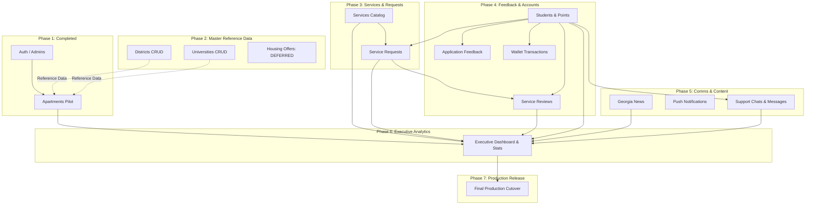

# Final Master Implementation Plan: Complete Admin Dashboard Migration to React + Vite + TypeScript
*(Fully Audited & Frozen — Master Plan for All Phases)*

> **⛔ Status: MASTER PLAN FROZEN — READY FOR PHASE-BY-PHASE EXECUTION**
> 
> | Phase | Description | Status |
> |---|---|---|
> | Phase 1 | Foundation, Auth, Apartments | `COMPLETED / VERIFIED / USER ACCEPTED ✅` |
> | Phase 2 | Districts & Universities | `COMPLETED / VERIFIED / USER ACCEPTED ✅` |
> | Phase 3 | Services & Service Requests | `COMPLETED / VERIFIED / USER ACCEPTED ✅` |
> | Phase 4 | Reviews Moderation, Feedback, Students & Points | `COMPLETED / VERIFIED / USER ACCEPTED ✅` |
> | Phase 5 | News, Notifications, Customer Support Chats | `IMPLEMENTED / STAGING VERIFIED — AWAITING USER UAT` |
> | Phase 6 | Executive Dashboard & Cross-Module Analytics | `IMPLEMENTED / STAGING VERIFIED — AWAITING USER UAT` |
> | Deferred | Housing Offers (Waiting for User Requirements) | `DEFERRED / FROZEN` |
> | Cutover | Phase 7 / Production Promotion | `NOT STARTED / REQUIRES EXPLICIT FINAL GO` |
> 
> **Execution Rule:** Each phase is executed sequentially (GO → Implement → Verify → Accept → STOP) without reopening architecture or redesigning interfaces.

---

## 🏛️ Master Architecture & Invariant Principles (Frozen & Authoritative)

1. **Functional + Visual Parity:** Exact visual and functional match with the Vanilla Admin dashboard. Zero UI/UX redesigns.
2. **Feature-Based Modular Structure:** All features reside in `src/modules/<feature>/`, `src/hooks/`, and `src/types/`.
3. **Environment & Path Isolation:**
   - Development (`.env.development`): `VITE_BASE_PATH=/`, `VITE_API_ROOT=/api_staging` (proxied to staging backend).
   - Staging (`.env.staging`): `VITE_BASE_PATH=/admin_v2/`, `VITE_API_ROOT=/api_staging` (connected to `absher_georgia_staging`).
   - Production (`.env.production`): `VITE_BASE_PATH=/admin/`, `VITE_API_ROOT=/api` (connected to `absher_georgia_db`).
4. **Synchronous Authentication Invariant:**
   - JWT token is synchronously persisted to `localStorage` before updating React state.
   - Protected routers and data-fetching hooks are strictly NOT mounted before authentication.
   - 401 status wipes token, triggers `auth:logout`, and smoothly displays the Login Overlay.
5. **Double-Submit Protection:**
   - Layer 1: Synchronous `useRef(false)` submit lock in form components.
   - Layer 2: Entity-specific `dedupeKey` in `apiFetch` for mutation requests.
6. **Runtime Response Validation:**
   - Raw wire responses are normalized and validated via `src/lib/validators.ts` before updating React state.
7. **Strict Production DB Safety:**
   - All migrations, feature implementations, and CRUD testing happen strictly against `absher_georgia_staging`.
   - Production DB `absher_georgia_db` is NEVER modified during intermediate phases.
   - The production Vanilla Admin (`/admin/`) remains 100% active and untouched until Final Cutover (Phase 7).

---

## 🗺️ Master Dependency Map & Table Inventory

### Complete Database Tables Inventory (15 Tables)

| # | Table Name | Domain / Purpose | Parent Table(s) | Foreign Key / Cascade Rules | Migration Phase |
|---|---|---|---|---|---|
| 1 | `admins` | Admin credentials & JWT auth | None | — | **Phase 1 ✅** |
| 2 | `apartments` | Apartments listings | `districts` | `district_id` -> `districts.id` (RESTRICT) | **Phase 1 ✅** |
| 3 | `districts` | Reference districts list | None | Referenced by `apartments.district_id` | **Phase 2** |
| 4 | `universities` | Reference universities list | None | Referenced in `apartments.universities` JSON | **Phase 2** |
| 5 | `housing_offers` | Exclusive housing discounts | `apartments` | `apartment_id` -> `apartments.id` (CASCADE) | **DEFERRED (User Requirements)** |
| 6 | `services` | Student services catalog | None | Referenced by `service_requests.service_id` | **Phase 3** |
| 7 | `service_requests` | Student booking requests | `services`, `students` | `service_id` -> `services.id`, `student_id` -> `students.id` | **Phase 3** |
| 8 | `service_reviews` | Student ratings & testimonials | `service_requests`, `students` | `service_request_id` -> `service_requests.id`, `student_id` -> `students.id` | **Phase 4** |
| 9 | `application_feedback` | User suggestions & bug reports | `students` | `student_id` -> `students.id` | **Phase 4** |
| 10 | `students` | Student accounts & profiles | None | Referenced by `requests`, `reviews`, `feedback`, `chats` | **Phase 4** |
| 11 | `wallet_transactions` | Points & wallet transactions | `service_requests`, `students` | Points log audit trail | **Phase 4** |
| 12 | `news` | Georgia & student news | None | Independent catalog | **Phase 5** |
| 13 | `notifications` | Push broadcast notifications | None | Target: all students or specific segment | **Phase 5** |
| 14 | `chats` | Student support conversations | `students` | `student_id` -> `students.id` | **Phase 5** |
| 15 | `chat_messages` | Chat messages & media | `chats` | `chat_id` -> `chats.id` | **Phase 5** |

---

### Cross-Module Dependency Flowchart



---

## 📡 Non-admin_api Direct Endpoints Inventory & Staging Isolation

The following direct PHP endpoints exist outside `admin_api.php` and are used by the dashboard. All have been verified and isolated in `api_staging/`:

| Direct Endpoint | Path (Production) | Path (Staging) | Auth Middleware | DB / Upload Dependency | Staging Isolation Proof |
|---|---|---|---|---|---|
| **Admin Login** | `api/admin/login.php` | `api_staging/admin/login.php` | Public / Bcrypt verification | Loads `config/db_staging.php` | Connects strictly to `absher_georgia_staging` DB |
| **Image Upload** | `api/upload/image.php` | `api_staging/upload/image.php` | `AuthMiddleware::requireAdmin()` | Loads `config/db_staging.php` | Writes physically to `uploads_staging/{folder}/` and returns `uploads_staging/{folder}/...` |
| **Chat Admin Reply** | `api/chat/admin_reply.php` | `api_staging/chat/admin_reply.php` | `AuthMiddleware::requireAdmin()` | Loads `config/db_staging.php` | Inserts message strictly into `absher_georgia_staging.chat_messages` |

---

## 🔔 External Side-Effect Audit & Isolation

### Audit Findings from Codebase
1. **Push Notifications:**
   - In `api/core/notification.php`, the function `sendStudentNotification($studentId, $title, $body)` executes an internal MySQL `INSERT INTO notifications (student_id, title, body, created_at) VALUES (?, ?, ?, NOW())`.
   - **Zero external FCM / Apple APNS HTTP requests** are made directly by PHP backend endpoints.
2. **Chat Replies:**
   - In `api/chat/admin_reply.php`, sending an admin reply executes an internal MySQL `INSERT INTO chat_messages` and calls `sendStudentNotification()`.
   - **Zero external SMS, Email, or Webhooks** are triggered.
3. **News & Services Announcements:**
   - Adding a news item or service creates an internal notification row in MySQL table `notifications`.

### Staging Isolation Guarantee
Because all staging endpoints load `config/db_staging.php`, all notification inserts and chat messages are written strictly to `absher_georgia_staging.notifications` and `absher_georgia_staging.chat_messages`. No production student devices receive notifications from staging operations.

---

## 📅 Master Phase Execution Breakdown

---

### Phase 1: Foundation & Apartments Pilot
- **Status:** `COMPLETED / VERIFIED / ACCEPTED ✅`
- **Accomplished Scope:**
  - Complete React 18 + Vite 5 + TypeScript foundation in `admin_react/`.
  - Environment-aware configurations (`.env.development`, `.env.staging`, `.env.production`).
  - Isolated Staging Backend (`api_staging/`, `config/db_staging.php`, `absher_georgia_staging`, `uploads_staging/`).
  - 12/12 Staging Safety Verification Gate tests passed.
  - Complete Apartments CRUD module with search, district filter, rental type filter, multi-image upload, image preservation/replacement, roommate fields toggle, double-submit protection.
  - Read-only loaders for `useDistricts` and `useUniversities`.
  - Fixed Authentication Race Condition (synchronous storage + strict route guard).
  - Deployed to `/var/www/absher/backend_php/admin_v2/` and passed user UAT.

---

### Phase 2: Master Reference Data (Districts & Universities)
*(Housing Offers is explicitly deferred)*
- **Goal:** Provide full CRUD management for Districts and Universities reference catalogs.
- **Modules Included:**
  1. **Districts Module (`/districts`)**:
     - **Exact Endpoint:** `ADMIN_API_URL` (`/api_staging/admin_api.php`)
     - **Get All:** `GET /api_staging/admin_api.php?action=get_all` -> Response: `res.districts` (Array of `{ id: number, name: string, name_ar: string, name_en: string|null, display_name: string }`)
     - **Add District:** `POST /api_staging/admin_api.php?action=add_district` -> Payload: `{ name: string, name_ar: string, name_en: string }` -> Response: `{ status: "success", message: "تم إضافة المنطقة بنجاح" }`
     - **Update District:** `POST /api_staging/admin_api.php?action=update_district` -> Payload: `{ id: number, name: string, name_ar: string, name_en: string }` -> Response: `{ status: "success", message: "تم تعديل المنطقة بنجاح" }`
     - **Delete District:** `POST /api_staging/admin_api.php?action=delete_district` -> Payload: `{ id: number }` -> Response: `{ status: "success", message: "تم حذف المنطقة بنجاح" }`
     - **UI / Behavior:** Search bar, card list with location icons, Add District Modal, Edit District Modal, Delete confirmation dialog.
  2. **Universities Module (`/universities`)**:
     - **Exact Endpoint:** `ADMIN_API_URL` (`/api_staging/admin_api.php`)
     - **Get All:** `GET /api_staging/admin_api.php?action=get_all` -> Response: `res.universities` (Array of `{ id: number, name: string, name_ar: string, name_en: string|null, display_name: string }`)
     - **Add University:** `POST /api_staging/admin_api.php?action=add_university` -> Payload: `{ name: string, name_ar: string, name_en: string }` -> Response: `{ status: "success", message: "تم إضافة الجامعة بنجاح" }`
     - **Update University:** `POST /api_staging/admin_api.php?action=update_university` -> Payload: `{ id: number, name: string, name_ar: string, name_en: string }` -> Response: `{ status: "success", message: "تم تعديل الجامعة بنجاح" }`
     - **Delete University:** `POST /api_staging/admin_api.php?action=delete_university` -> Payload: `{ id: number }` -> Response: `{ status: "success", message: "تم حذف الجامعة بنجاح" }`
     - **UI / Behavior:** Search bar, university card list with graduation cap icon, Add University Modal, Edit University Modal, Delete confirmation dialog.
  3. **Housing Offers Module:**
     > **DEFERRED — USER REQUIREMENTS WILL BE PROVIDED LATER.**
     > No final contracts, no implementation files, no acceptance criteria, and no code changes will be performed until requirements are received from the user.
- **Files to Create:**
  - `src/modules/districts/DistrictsModule.tsx`, `AddDistrictModal.tsx`, `EditDistrictModal.tsx`
  - `src/modules/universities/UniversitiesModule.tsx`, `AddUniversityModal.tsx`, `EditUniversityModal.tsx`
- **Files to Modify:**
  - `src/hooks/useDistricts.ts` (add `addDistrict`, `updateDistrict`, `deleteDistrict` mutation functions)
  - `src/hooks/useUniversities.ts` (add `addUniversity`, `updateUniversity`, `deleteUniversity` mutation functions)
  - `src/App.tsx` (register routes: `/districts`, `/universities`)
  - `src/layouts/AdminLayout.tsx` (activate sidebar items for Districts and Universities)
- **Staging Fixtures (Phase 2):**
  - Staging DB already contains 8 standard reference districts and 8 standard reference universities.
- **Acceptance Checklist (Phase 2):**
  - `[ ]` Districts: List rendered, Add bilingual district, Edit district, Delete district.
  - `[ ]` Universities: List rendered, Add bilingual university, Edit university, Delete university.
  - `[ ]` Cross-update: Adding/editing a district/university immediately reflects in Apartments Add/Edit dropdowns.
  - `[ ]` Direct refresh: `/admin_v2/districts` and `/admin_v2/universities` load on browser refresh with HTTP 200.
  - `[ ]` Quality Gates: `npx tsc --noEmit` (0 errors), `npm run lint` (0 errors), `npm run build:staging` (succeeds).
- **STOP Condition:** Deploy Phase 2 to staging `/admin_v2/` and wait for user acceptance before Phase 3.

---

### Phase 3: Student Services & Requests Lifecycle
- **Goal:** Manage student services catalog and handle service booking requests operational lifecycle.
- **Dependency Invariant:** Service Requests in Phase 3 requires ONLY Student reference data (provided via relational join `s.full_name, s.phone` in `get_all` and deterministic student fixtures), NOT the full Student Accounts CRUD module.
- **Modules Included:**
  1. **Services Module (`/services`)**:
     - **Exact Endpoint:** `ADMIN_API_URL` (`/api_staging/admin_api.php`)
     - **Get All:** `GET /api_staging/admin_api.php?action=get_all` -> Response: `res.services` (Array of `{ id: number, title: string, title_ar: string, title_en: string, description: string, description_ar: string, description_en: string, image_url: string, has_form: number, price_points: number }`)
     - **Add Service:** `POST /api_staging/admin_api.php?action=add_service` -> Payload: `{ title_ar: string, title_en: string, description_ar: string, description_en: string, image_url: string, has_form: number, price_points: number }` -> Response: `{ status: "success", message: "تم إضافة الخدمة بنجاح" }`
     - **Update Service:** `POST /api_staging/admin_api.php?action=update_service` -> Payload: `{ id: number, title_ar: string, title_en: string, description_ar: string, description_en: string, image_url: string, has_form: number, price_points: number }` -> Response: `{ status: "success", message: "تم تعديل الخدمة بنجاح" }`
     - **Delete Service:** `POST /api_staging/admin_api.php?action=delete_service` -> Payload: `{ id: number }` -> Response: `{ status: "success", message: "تم حذف الخدمة بنجاح" }`
     - **Upload Mechanism:** Base64 image upload via `saveBase64IfPresent` in `add_service` / `update_service`.
     - **UI / Behavior:** Grid of service cards, Add Service Modal with image selector, Edit Service Modal, points toggle, Delete confirmation.
  2. **Service Requests Module (`/requests`)**:
     - **Exact Endpoint:** `ADMIN_API_URL` (`/api_staging/admin_api.php`)
     - **Get All:** `GET /api_staging/admin_api.php?action=get_all` -> Response: `res.requests` (Array of `{ id: number, student_id: number, service_id: number, service_title: string, student_name: string, student_phone: string, status: string, form_data: string, created_at: string }`)
     - **Update Status:** `POST /api_staging/admin_api.php?action=update_request_status` -> Payload: `{ id: number, status: 'جديد' | 'قيد التنفيذ' | 'مكتمل' | 'ملغي' }` -> Response: `{ status: "success", message: "تم تحديث حالة الطلب بنجاح" }`
     - **Delete Request:** `POST /api_staging/admin_api.php?action=delete_request` -> Payload: `{ id: number }` -> Response: `{ status: "success", message: "تم حذف الطلب بنجاح" }`
     - **UI / Behavior:** Status filter tabs (All, New, In Progress, Completed, Cancelled), Request details modal displaying submitted student form data, status transition dropdown, dual direct contact buttons: WhatsApp direct link (`https://wa.me/...`) AND Open Support Chat button (`/chats?student_id=<REQUEST_STUDENT_ID>`).
     - **Cross-Module Link Invariant (Service Requests -> Customer Support Chat):**
        - Request cards and Request details modal must render both buttons (`[ واتساب ]` and `[ فتح محادثة الدعم ]`).
        - The chat button navigates directly to `/chats?student_id=${request.student_id}`.
        - Primary key linkage is strictly `student_id` (never student name or phone).
        - In Phase 3, this link is rendered without executing or stubbing the Phase 5 Chats module.
- **Media & Image Handling Rules:**
  - Zero external stock photos / Unsplash URLs in database or code fixtures.
  - All image rendering across cards and modals must use the centralized `getMediaUrl(url)` resolver (`src/lib/media.ts`) to ensure relative upload paths (`uploads_staging/...`) normalize to root paths (`/uploads_staging/...`) and avoid 404s under SPA subpaths (`/admin_v2/`).
  - When an image is absent or errors, render a clean, neutral dark-surface placeholder UI with an icon, not a remote placeholder image.
- **Files to Create:**
  - `src/lib/media.ts`
  - `src/types/service.ts`, `src/types/request.ts`
  - `src/hooks/useServices.ts`, `src/hooks/useRequests.ts`
  - `src/modules/services/ServicesModule.tsx`, `ServiceCard.tsx`, `AddServiceModal.tsx`, `EditServiceModal.tsx`
  - `src/modules/requests/RequestsModule.tsx`, `RequestCard.tsx`, `RequestDetailsModal.tsx`
- **Files to Modify:**
  - `src/lib/validators.ts` (added `parseService`, `parseServices`, `parseRequest`, `parseRequests`)
  - `src/lib/i18n.tsx` (added full translation keys for services and requests)
  - `src/App.tsx` (register routes: `/services`, `/requests`)
  - `src/layouts/AdminLayout.tsx` (activate sidebar items for Services and Requests)
- **Staging Fixtures (Phase 3):**
  - 4 deterministic services (e.g. "إقامة دراسية", "ترجمة مستندات", "تأمين صحي", "استقبال مطار").
  - 4 deterministic service requests spanning each status (`جديد`, `قيد التنفيذ`, `مكتمل`, `ملغي`).
- **Acceptance Checklist (Phase 3):**
  - `[ ]` Services: Grid renders, Add service with image, Edit service, Delete service.
  - `[ ]` Requests: Requests display student name, service name, date, and status.
  - `[ ]` Status transition: Transition request from `جديد` -> `قيد التنفيذ` -> `مكتمل`.
  - `[ ]` Details Modal: View full student form submissions.
  - `[ ]` Quality Gates: `npx tsc --noEmit` (0 errors), `npm run lint` (0 errors), `npm run build:staging` (succeeds).
- **STOP Condition:** Deploy Phase 3 to staging `/admin_v2/` and wait for user acceptance before Phase 4.

---

### Phase 4: Feedback, Moderation & Student Accounts (High-Density & Extension)
- **Status:** `IMPLEMENTED / STAGING VERIFIED / READY FOR USER REVIEW ✅`
- **Accomplished Scope:**
  1. **Service Reviews Moderation (`/reviews`)**:
     - **High-Density Compact Layout:** Single ultra-compact analytics strip (average score, star distribution, total count), unified single-line toolbar (status pills, search, count), responsive 3-4 card grid (`minmax(260px, 1fr)`), compact clamped comments with expand toggle.
     - Moderation (`approved` / `rejected`), Delete review with confirmation.
     - Sidebar Attention Badge: Live counter of pending reviews (`status === 'pending'`).
  2. **Application Feedback Inbox (`/feedback`)**:
     - **High-Density Compact Layout:** Unified single-row toolbar (status tabs, category select, search, count), responsive 3-4 card grid (`minmax(260px, 1fr)`), compact comments with expand toggle, streamlined status actions.
     - Status transition (`pending` -> `reviewed` -> `resolved`), Delete feedback.
     - Sidebar Attention Badge: Live counter of pending feedback (`status === 'pending'`).
  3. **Students Administration & Extension (`/students`)**:
     - **Preserved User-Approved Design:** Clean integration of all new fields without bloating card heights.
     - **Nationality Field:** Added `students.nationality` (required in Admin Add Student Modal, displayed on Student Card).
     - **Admin Status & Note (Strict Privacy Invariant):** Added `admin_status` and `admin_note` to `students` table. Managed via centered `AdminMetaModal.tsx`. 100% PRIVATE to admin—never exposed to public/student endpoints (`auth/me.php`, `login.php`, `register.php`, `profile/get.php`).
     - **Persistent Identity Blocklist & Enforcement:** Dedicated `blocked_identities` table with canonical email/phone normalization (`identity_block.php`). Block action on card sets `is_blocked = 1` and inserts normalized credentials into `blocked_identities`. Rejects student login and registration attempts with 403.
     - **Block-After-Delete Invariant:** Deleting student account via `delete_student` preserves records in `blocked_identities`. Registration with blocked identity remains blocked even after student row deletion.
     - **Blocked List Modal:** `BlockedIdentitiesModal.tsx` accessible via `[ قائمة المحظورين ]` button on header to view and unblock orphaned or persistent blocked identities.
  4. **Database & Backend Isolation:**
     - Migration `2026_08_phase4_students_extension.sql` applied to `absher_georgia_staging`.
     - Production database `absher_georgia_db` is **100% UNTOUCHED and ISOLATED**.
  5. **Automated Verification:**
     - 13/13 automated staging backend tests passed (schema, nationality validation, admin meta, privacy check, blocking, login denial, registration rejection, delete + block persistence, registration rejection after deletion, unblocking, prod DB isolation).
     - `npx tsc --noEmit` (0 errors), `npx eslint` (0 errors), `npm run build:staging` (succeeded).
     - Deployed to `http://80.241.218.23/admin_v2/`.

---

### Phase 5: Content, Broadcasting & Live Communications
- **Goal:** Manage news publishing, broadcast push notifications, and live customer support chats.
- **Modules Included:**
  1. **Georgia News Module (`/news`)**:
     - **Exact Endpoint:** `ADMIN_API_URL` (`/api_staging/admin_api.php`)
     - **Get All:** `GET /api_staging/admin_api.php?action=get_all` -> Response: `res.news` (Array of `{ id: number, title: string, title_ar: string, title_en: string, content: string, content_ar: string, content_en: string, image_url: string, created_at: string }`)
     - **Add News:** `POST /api_staging/admin_api.php?action=add_news` -> Payload: `{ title_ar: string, title_en: string, content_ar: string, content_en: string, image_url: string }` -> Response: `{ status: "success", message: "تم نشر الخبر والتنبيه بنجاح" }`
     - **Update News:** `POST /api_staging/admin_api.php?action=update_news` -> Payload: `{ id: number, title_ar: string, title_en: string, content_ar: string, content_en: string, image: string }` -> Response: `{ status: "success", message: "تم تعديل الخبر بنجاح" }`
     - **Delete News:** `POST /api_staging/admin_api.php?action=delete_news` -> Payload: `{ id: number }` -> Response: `{ status: "success", message: "تم حذف الخبر بنجاح" }`
     - **Upload Mechanism:** Image upload via `upload/image.php?folder=news`.
     - **UI / Behavior:** News article cards, Add News Modal with image upload, Edit News Modal, Delete confirmation dialog.
  2. **Alerts & Notifications Module (`/notifications`)**:
     - **Exact Endpoint:** `ADMIN_API_URL` (`/api_staging/admin_api.php`)
     - **Get All:** `GET /api_staging/admin_api.php?action=get_all` -> Response: `res.notifications` (Array of `{ id: number, student_id: number, title: string, body: string, created_at: string }`)
     - **Add Notification:** `POST /api_staging/admin_api.php?action=add_notification` -> Payload: `{ title: string, body: string }` -> Response: `{ status: "success", message: "تم نشر التنبيه والإشعار بنجاح" }`
     - **Delete Notification:** `POST /api_staging/admin_api.php?action=delete_notification` -> Payload: `{ id: number }` -> Response: `{ status: "success", message: "تم حذف التنبيه بنجاح" }`
     - **UI / Behavior:** Broadcast history table, Send Push Notification Modal, Delete broadcast record.
  3. **Customer Support Chats Module (`/chats`)**:
     - **Get All Conversations:** `GET /api_staging/admin_api.php?action=get_all` -> Response: `res.chats` (Array of `{ id: number, student_name: string, phone: string, student_id: number|null, last_msg: string, status: string, time: string, messages: Array<{ id: number, sender: 'student'|'admin', text: string, type: 'text'|'image', imageUrl: string|null, quoteText: string|null, quoteSender: string|null, deleted: boolean, time: string }> }`)
     - **Send Reply Endpoint:** `POST /api_staging/chat/admin_reply.php` -> Payload: `{ chat_id: number, content: string, message_type: 'text' | 'image', image_url?: string, quote_text?: string, quote_sender?: string }` -> Response: `{ success: true, message: "Message sent", data: { message_id: number } }`
     - **Edit Message:** `POST /api_staging/admin_api.php?action=edit_chat_message` -> Payload: `{ message_id: number, text: string }` -> Response: `{ status: "success", message: "تم تعديل الرسالة بنجاح" }`
     - **Delete Message:** `POST /api_staging/admin_api.php?action=delete_chat_message` -> Payload: `{ message_id: number }` -> Response: `{ status: "تم حذف الرسالة بنجاح" }`
     - **Delete Conversation:** `POST /api_staging/admin_api.php?action=delete_chat` -> Payload: `{ chat_id: number }` -> Response: `{ status: "success", message: "تم حذف المحادثة بنجاح" }`
     - **Upload Mechanism:** Chat media upload via `upload/image.php?folder=chat`.
     - **UI / Behavior & Cross-Module Deep-Linking:**
       - Two-column chat interface (left: conversations list with unread counter, right: message thread), real-time polling (3s interval), text message input, image attachment picker, message quote/reply banner, inline edit/delete popup, student info panel.
       - **Deep-linking Invariant:** When navigated to via `/chats?student_id=<ID>`:
         1. Reads `student_id` directly from URL query parameters.
         2. Auto-locates and opens the corresponding student conversation if it exists.
         3. If no conversation exists for that `student_id`, opens customer support view in a clean empty state without crashing.
         4. Links strictly via `student_id` (not student name or phone number).
- **Files to Create:**
  - `src/types/news.ts`, `src/types/notification.ts`, `src/types/chat.ts`
  - `src/hooks/useNews.ts`, `src/hooks/useNotifications.ts`, `src/hooks/useChats.ts`
  - `src/modules/news/NewsModule.tsx`, `NewsCard.tsx`, `AddNewsModal.tsx`, `EditNewsModal.tsx`
  - `src/modules/notifications/NotificationsModule.tsx`, `SendNotificationModal.tsx`
  - `src/modules/chats/ChatsModule.tsx`, `ChatConversationList.tsx`, `ChatMessageThread.tsx`, `ChatInputBar.tsx`
- **Files to Modify:**
  - `src/App.tsx` (register routes: `/news`, `/notifications`, `/chats`)
  - `src/layouts/AdminLayout.tsx` (activate sidebar items for News, Notifications, Chats)
- **Staging Fixtures (Phase 5):**
  - 3 deterministic news articles with images.
  - 3 past broadcast notification rows.
  - 3 active student chat threads with historical message exchanges.
- **Acceptance Checklist (Phase 5):**
  - `[ ]` News: Create, edit, delete news articles with images.
  - `[ ]` Notifications: Compose and broadcast notification, view broadcast history.
  - `[ ]` Chats: Select conversation, send text reply, send image attachment, edit message, delete message, poll updates cleanly.
  - `[ ]` Quality Gates: `npx tsc --noEmit` (0 errors), `npm run lint` (0 errors), `npm run build:staging` (succeeds).
- **STOP Condition:** Deploy Phase 5 to staging `/admin_v2/` and wait for user acceptance before Phase 6.

---

### Phase 6: Executive Dashboard & Cross-Module Analytics
- **Goal:** Complete the top-level Overview Dashboard aggregating metrics across all modules.
- **Modules Included:**
  1. **Dashboard Overview (`/` and `/dashboard`)**:
     - **Exact Endpoint:** `ADMIN_API_URL` (`/api_staging/admin_api.php`)
     - **Get All:** `GET /api_staging/admin_api.php?action=get_all`
     - **Metrics Aggregated:** Total Apartments, Total Services, Active Requests, Total Students, Average Review Rating, Pending Feedback, Active Support Chats.
     - **UI / Behavior:** 6 top KPI summary cards, Service bookings breakdown widget, Reviews rating distribution widget, Quick Action shortcuts to each module, Latest 5 requests feed, Latest 5 student registrations feed.
- **Files to Create:**
  - `src/types/dashboard.ts`
  - `src/hooks/useDashboardStats.ts`
  - `src/modules/dashboard/DashboardModule.tsx`, `StatCard.tsx`, `RecentActivityWidget.tsx`, `RatingDistributionWidget.tsx`
- **Files to Modify:**
  - `src/App.tsx` (configure `/` and `/dashboard` to render `DashboardModule`)
  - `src/layouts/AdminLayout.tsx` (activate sidebar navigation for Dashboard Overview)
- **Acceptance Checklist (Phase 6):**
  - `[ ]` Dashboard KPIs match real database counts in Staging.
  - `[ ]` Rating distribution and service analytics widgets render correctly.
  - `[ ]` Quick action links navigate directly to respective modules.
  - `[ ]` All 12 Sidebar navigation items are active, functional, and fully migrated.
  - `[ ]` Zero remaining Vanilla JS files needed for dashboard functionality.
  - `[ ]` Quality Gates: `npx tsc --noEmit` (0 errors), `npm run lint` (0 errors), `npm run build:staging` (succeeds).
- **STOP Condition:** Deploy complete React Dashboard to staging `/admin_v2/` and conduct full End-to-End system acceptance before Phase 7.

---

### Phase 7: Final Production Cutover & Promotion
- **Goal:** Safely promote the accepted React build to `/admin/` (Production) with zero downtime and instant rollback capability.
- **Prerequisites:**
  1. All Phases (1 through 6) fully accepted on Staging.
  2. Git commit SHA recorded and verified (`git rev-parse HEAD`).
  3. Production build generated with `npm run build:prod` (verifying `VITE_BASE_PATH=/admin/` and `VITE_API_ROOT=/api`).
  4. Gate 4 verified: `grep -r "admin_v2" dist/` returns 0 matches in code bundles.
- **Cutover Execution Runbook (on VPS `80.241.218.23`):**
  1. Upload production release folder to `/var/www/absher/backend_php/admin_release_<RELEASE_ID>/`.
  2. Verify release checksum and `.release_sha`.
  3. Atomic Backup & Swap:
     ```bash
     cd /var/www/absher/backend_php
     BACKUP_ID=$(date +%Y%m%d_%H%M%S)
     mv admin "admin_backup_${BACKUP_ID}"
     mv "admin_release_${RELEASE_ID}" admin || mv "admin_backup_${BACKUP_ID}" admin
     ```
  4. Record cutover log in `/var/www/absher/last_cutover.txt`.
  5. Post-Cutover Smoke Tests on `http://80.241.218.23/admin/`:
     - Login with production admin credentials.
     - Verify Dashboard, Apartments, Services, Requests, Reviews, Feedback, Students, News, Notifications, Chats.
     - Direct route refresh on `/admin/apartments` (HTTP 200).
     - Verify Network requests go to `/api/admin_api.php` (Production DB).
- **Rollback Runbook (if any unexpected blocker occurs):**
  ```bash
  cd /var/www/absher/backend_php
  mv admin "admin_failed_$(date +%Y%m%d_%H%M%S)"
  mv "admin_backup_${BACKUP_ID}" admin
  ```
- **Post-Cutover Completion:**
  - Preserve `admin_v2/` for future feature development/staging testing.
  - Archive old Vanilla JS assets safely in `/var/www/absher/legacy_vanilla_backup/`.

---

## 🛡️ Risk Matrix & Mitigations

| Risk | Likelihood | Impact | Built-in Mitigation in Plan |
|---|---|---|---|
| **Foreign Key Constraint Violations** | Low | High | Deletion of parent entities (e.g. Apartments, Services, Students) is guarded by cascade warnings and automated child deletion where supported by DB schema (`housing_offers` CASCADE). |
| **Double-Submit on Slow Connections** | Medium | Medium | Two-tier locking: `useRef` synchronous component lock + `apiFetch` inFlight deduplication. |
| **Authentication / Session Loss** | Low | High | Synchronous JWT persistence in `AuthContext` + early exit in `apiFetch` + route guard preventing unauthenticated component mounting. |
| **SPA 404 on Browser Refresh** | Low | High | Source-controlled `.htaccess` with directory-relative rewrite rules (`RewriteRule ^ index.html [L]`) and anti-cache headers for `index.html`. |
| **Production Cross-Contamination** | Zero | Critical | Absolute separation of `.env`, database (`absher_georgia_staging`), API endpoints (`api_staging/`), and upload folders (`uploads_staging/`). Production DB remains untouched until Phase 7. |

---

## 🔒 Consistency Audit & Authoritative Freezing

This Master Plan has undergone a comprehensive consistency audit:
- **0 Ambiguities:** All actions, endpoints, HTTP methods, payloads, response paths, and upload mechanisms are specified with exact names.
- **0 Missing Modules:** All 13 Vanilla admin modules and all 15 database tables are assigned to exact phases.
- **0 Overlapping Scopes:** Every module is mapped to exactly one phase.
- **Housing Offers Handled:** Explicitly documented as `DEFERRED — WAITING FOR USER REQUIREMENTS`.
- **Strict Reuse:** AuthContext, apiFetch, validators, i18n, ThemeContext, Toast, ConfirmDialog, and AdminLayout from Phase 1 are reused as the core foundation for all subsequent phases.
- **Execution-Ready:** Phases 2 through 7 are completely specified and ready for sequential execution upon user instruction.
