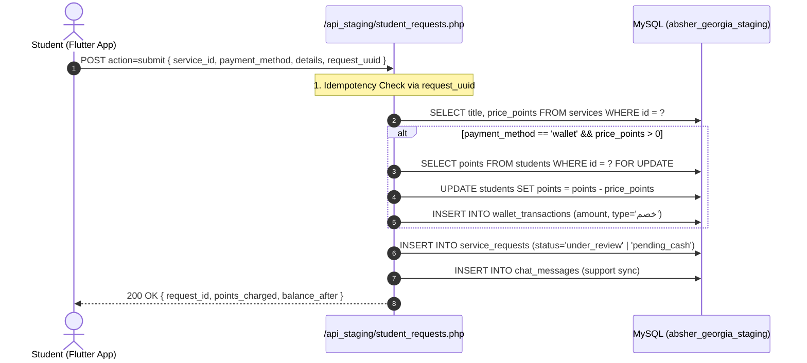

# Verified Phase 6A Implementation Plan — Promo Codes & Discounts

*(Audit-Backed Architectural Specification & Implementation Roadmap)*

> **⛔ Status: AUDIT AND IMPLEMENTATION PLAN COMPLETE — NO CODE CHANGES MADE — WAITING FOR USER APPROVAL TO START PHASE 6A**
> 
> | Phase | Description | Status |
> |---|---|---|
> | Phase 1 | Foundation, Auth, Apartments | `COMPLETED / VERIFIED / USER ACCEPTED ✅` |
> | Phase 2 | Districts & Universities | `COMPLETED / VERIFIED / USER ACCEPTED ✅` |
> | Phase 3 | Services & Service Requests | `COMPLETED / VERIFIED / USER ACCEPTED ✅` |
> | Phase 4 | Reviews Moderation, Feedback, Students & Points | `COMPLETED / VERIFIED / USER ACCEPTED ✅` |
> | Phase 5 | News, Notifications, Customer Support Chats | `COMPLETED / VERIFIED / USER ACCEPTED ✅` |
> | Phase 6 | Executive Dashboard & Cross-Module Analytics | `COMPLETED / VERIFIED / USER ACCEPTED ✅` |
> | **Phase 6A** | **Promo Codes & Discounts System** | **PLANNED / READY FOR REVIEW (THIS SPEC)** |
> | Deferred | Housing Offers (Waiting for User Requirements) | `DEFERRED / FROZEN` |
> | Cutover | Phase 7 / Production Promotion | `NOT STARTED — REQUIRES EXPLICIT USER GO` |

---

## 1. Verified Current-State Audit (with File & Line References)

A thorough audit of the real repository codebase and Staging MySQL database (`absher_georgia_staging`) was performed:

### A. Flutter Student Service Request Flow
- **Form Screen:** [`lib/screens/services_screen.dart`](file:///c:/Users/moham/Desktop/absher/lib/screens/services_screen.dart#L180-L710)
  - Line 189: `final promoCtrl = TextEditingController();`
  - Lines 481–490: Dumb input field rendered as:
    ```dart
    TextField(
      controller: promoCtrl,
      decoration: InputDecoration(
        labelText: LanguageService.tr('promo_code'),
        prefixIcon: const Icon(Icons.discount, color: AppColors.accent),
        border: OutlineInputBorder(borderRadius: BorderRadius.circular(12)),
      ),
    )
    ```
  - Lines 642–657: The promo code is purely concatenated into a localized free-text string `details` (e.g. `\n[كود الخصم: XYZ]`).
  - Lines 690–705: `ApiService.submitServiceRequest` is called. **`promo_code` is NOT transmitted as a discrete parameter.**
  - **Audit Finding:** Zero validation, zero discount calculation, and zero pricing breakdown currently exist on Flutter.

### B. Mobile API Service Layer
- **File:** [`lib/services/api_service.dart`](file:///c:/Users/moham/Desktop/absher/lib/services/api_service.dart#L523-L576)
  - Method `submitServiceRequest` accepts: `serviceId`, `studentName`, `studentPhone`, `studentUni`, `universityId`, `serviceTitle`, `details`, `payWithPoints`, `paymentMethod`, `requestUuid`.
  - Dispatches `POST` to `$baseUrl/student_requests.php` with `action: 'submit'`.
  - **Audit Finding:** No validation endpoint (`validate_promo`) exists.

### C. Backend Request Reception & Pricing
- **File:** [`backend_php/api_staging/student_requests.php`](file:///c:/Users/moham/Desktop/absher/backend_php/api_staging/student_requests.php#L285-L475)
  - Service price is loaded strictly from `services.price_points` (line 293: `SELECT title, price_points FROM services WHERE id = ?`).
  - Wallet deduction: If `payWithPoints && pricePoints > 0`, acquires a row lock on student balance via `SELECT points FROM students WHERE id = ? FOR UPDATE` (line 352).
  - Deducts full `pricePoints` via `UPDATE students SET points = points - ? WHERE id = ? AND points >= ?` (line 364).
  - Inserts `service_requests` row with `service_price_points` and `points_charged` (line 375).
  - Inserts `wallet_transactions` row with `amount = pricePoints`, `type = 'خصم'`, `service_request_id = requestId` (line 383).
  - **Audit Finding:** Staging backend currently deducts 100% of `service_price_points` without support for promo discounts.

### D. Staging Database Schema & Table Inventory
- Executed `SHOW TABLES` on `absher_georgia_staging`:
  - 16 existing tables: `admins`, `apartments`, `application_feedback`, `blocked_identities`, `chat_messages`, `chats`, `districts`, `housing_offers`, `news`, `notifications`, `service_requests`, `service_reviews`, `services`, `students`, `universities`, `wallet_transactions`.
  - **Audit Finding:** **Zero promo code tables or columns exist in the database.**

---

## 2. Confirmed Existing Request & Payment Flow



---

## 3. Verified Gaps & Data-Model Blockers

> [!IMPORTANT]
> ### Critical Finding: Cash Pricing Model
> 1. **Data Model Fact:** In the existing database, `services` has ONLY `price_points` (integer). There is NO separate cash monetary column (e.g. `price_gel` or `price_usd`) in `services` or `service_requests`.
> 2. **Current Cash Flow:** When a student chooses `payment_method = 'cash'`, `points_charged` is set to `0`, `service_requests.status` is set to `'pending_cash'`, and the service request detail notes that payment will be collected in cash upon execution.
> 3. **Promo Code Implication on Cash:** 
>    - For **Percentage Discount** and **Free Service** codes: The discount applies cleanly to the cash order (e.g. 20% off or Free).
>    - For **Fixed Value Discount** codes: Because prices in the system are currently unitless points/integers, fixed discounts apply to the base `services.price_points` integer value.
>    - **Architectural Decision:** We do NOT invent artificial currency conversion rates. Discounts operate directly on the authoritative service price value (`services.price_points`).

---

## 4. Exact Database Schema & Migration Plan

### Migration Script: `sql/migrations/2026_08_phase6a_promo_codes.sql`

```sql
-- Phase 6A: Promo Codes & Discounts Schema Migration
-- Target: absher_georgia_staging ONLY (Production isolated)

-- 1. Main Promo Codes Table
CREATE TABLE IF NOT EXISTS `promo_codes` (
  `id` INT AUTO_INCREMENT PRIMARY KEY,
  `campaign_name` VARCHAR(255) NOT NULL,
  `code` VARCHAR(50) COLLATE utf8mb4_unicode_ci NOT NULL,
  `discount_type` ENUM('percentage', 'fixed', 'free') NOT NULL,
  `discount_value` DECIMAL(10, 2) NOT NULL DEFAULT 0.00,
  `max_discount_points` INT NULL DEFAULT NULL,
  `min_service_price_points` INT NOT NULL DEFAULT 0,
  `start_at` DATETIME NULL DEFAULT NULL,
  `expires_at` DATETIME NULL DEFAULT NULL,
  `status` ENUM('active', 'paused', 'archived') NOT NULL DEFAULT 'active',
  `service_scope` ENUM('all', 'selected') NOT NULL DEFAULT 'all',
  `payment_scope` ENUM('all', 'wallet', 'cash') NOT NULL DEFAULT 'all',
  `audience_scope` ENUM('all', 'selected') NOT NULL DEFAULT 'all',
  `total_usage_limit` INT NULL DEFAULT NULL,
  `per_student_limit` INT NOT NULL DEFAULT 1,
  `used_count` INT NOT NULL DEFAULT 0,
  `created_at` DATETIME DEFAULT CURRENT_TIMESTAMP,
  `updated_at` DATETIME DEFAULT CURRENT_TIMESTAMP ON UPDATE CURRENT_TIMESTAMP,
  UNIQUE KEY `uq_promo_code` (`code`),
  INDEX `idx_promo_status_dates` (`status`, `start_at`, `expires_at`)
) ENGINE=InnoDB DEFAULT CHARSET=utf8mb4 COLLATE=utf8mb4_unicode_ci;

-- 2. Promo Code Service Eligibility (when service_scope = 'selected')
CREATE TABLE IF NOT EXISTS `promo_code_services` (
  `id` INT AUTO_INCREMENT PRIMARY KEY,
  `promo_code_id` INT NOT NULL,
  `service_id` INT NOT NULL,
  `created_at` DATETIME DEFAULT CURRENT_TIMESTAMP,
  UNIQUE KEY `uq_promo_service` (`promo_code_id`, `service_id`),
  CONSTRAINT `fk_pcs_promo` FOREIGN KEY (`promo_code_id`) REFERENCES `promo_codes` (`id`) ON DELETE CASCADE,
  CONSTRAINT `fk_pcs_service` FOREIGN KEY (`service_id`) REFERENCES `services` (`id`) ON DELETE CASCADE
) ENGINE=InnoDB DEFAULT CHARSET=utf8mb4 COLLATE=utf8mb4_unicode_ci;

-- 3. Promo Code Student Audience Eligibility (when audience_scope = 'selected')
CREATE TABLE IF NOT EXISTS `promo_code_students` (
  `id` INT AUTO_INCREMENT PRIMARY KEY,
  `promo_code_id` INT NOT NULL,
  `student_id` INT NOT NULL,
  `created_at` DATETIME DEFAULT CURRENT_TIMESTAMP,
  UNIQUE KEY `uq_promo_student` (`promo_code_id`, `student_id`),
  CONSTRAINT `fk_pcst_promo` FOREIGN KEY (`promo_code_id`) REFERENCES `promo_codes` (`id`) ON DELETE CASCADE,
  CONSTRAINT `fk_pcst_student` FOREIGN KEY (`student_id`) REFERENCES `students` (`id`) ON DELETE CASCADE
) ENGINE=InnoDB DEFAULT CHARSET=utf8mb4 COLLATE=utf8mb4_unicode_ci;

-- 4. Immutable Redemption History & Audit Trail
CREATE TABLE IF NOT EXISTS `promo_code_redemptions` (
  `id` INT AUTO_INCREMENT PRIMARY KEY,
  `promo_code_id` INT NOT NULL,
  `service_request_id` INT NOT NULL,
  `student_id` INT NOT NULL,
  `service_id` INT NOT NULL,
  `code_snapshot` VARCHAR(50) NOT NULL,
  `campaign_snapshot` VARCHAR(255) NOT NULL,
  `discount_type_snapshot` VARCHAR(20) NOT NULL,
  `discount_value_snapshot` DECIMAL(10, 2) NOT NULL,
  `original_price_points` INT NOT NULL,
  `discount_points` INT NOT NULL,
  `final_price_points` INT NOT NULL,
  `payment_method` VARCHAR(30) NOT NULL,
  `status` ENUM('applied', 'reversed') NOT NULL DEFAULT 'applied',
  `reversed_at` DATETIME NULL DEFAULT NULL,
  `reversed_reason` VARCHAR(255) NULL DEFAULT NULL,
  `created_at` DATETIME DEFAULT CURRENT_TIMESTAMP,
  UNIQUE KEY `uq_redemption_request` (`service_request_id`),
  INDEX `idx_redemption_promo_student` (`promo_code_id`, `student_id`),
  INDEX `idx_redemption_student` (`student_id`, `created_at`),
  CONSTRAINT `fk_pcr_promo` FOREIGN KEY (`promo_code_id`) REFERENCES `promo_codes` (`id`) ON DELETE RESTRICT,
  CONSTRAINT `fk_pcr_request` FOREIGN KEY (`service_request_id`) REFERENCES `service_requests` (`id`) ON DELETE RESTRICT,
  CONSTRAINT `fk_pcr_student` FOREIGN KEY (`student_id`) REFERENCES `students` (`id`) ON DELETE RESTRICT,
  CONSTRAINT `fk_pcr_service` FOREIGN KEY (`service_id`) REFERENCES `services` (`id`) ON DELETE RESTRICT
) ENGINE=InnoDB DEFAULT CHARSET=utf8mb4 COLLATE=utf8mb4_unicode_ci;

-- 5. Extend service_requests table with snapshot fields
ALTER TABLE `service_requests`
  ADD COLUMN `promo_code_id` INT NULL AFTER `service_id`,
  ADD COLUMN `discount_points` INT NOT NULL DEFAULT 0 AFTER `service_price_points`,
  ADD COLUMN `final_price_points` INT NOT NULL DEFAULT 0 AFTER `discount_points`,
  ADD CONSTRAINT `fk_sr_promo` FOREIGN KEY (`promo_code_id`) REFERENCES `promo_codes` (`id`) ON DELETE SET NULL;
```

---

## 5. Exact Backend Endpoints & Payloads

### A. Student Validation Endpoint: `POST /api_staging/services/validate_promo.php`
- **Authentication:** Optional/Bearer JWT (if authenticated, evaluates student audience & per-student usage limits).
- **Request Payload:**
  ```json
  {
    "code": "WELCOME20",
    "service_id": 3,
    "payment_method": "wallet"
  }
  ```
- **Success Response (HTTP 200):**
  ```json
  {
    "status": "success",
    "data": {
      "is_valid": true,
      "promo_code_id": 1,
      "code": "WELCOME20",
      "campaign_name": "خصم ترحيبي بالطلاب الجدد",
      "discount_type": "percentage",
      "discount_value": 20.0,
      "original_price": 100,
      "discount_amount": 20,
      "final_price": 80,
      "message": "تم تطبيق كود الخصم بنجاح (-20 نقطة)"
    }
  }
  ```
- **Failure Response (HTTP 200 / 400 with machine codes):**
  ```json
  {
    "status": "error",
    "error_code": "EXPIRED",
    "message": "كود الخصم منتهي الصلاحية"
  }
  ```
  **Supported Error Codes:**
  - `INVALID_CODE` (`كود الخصم غير موجود أو غير صحيح`)
  - `DISABLED` (`كود الخصم معطل حالياً`)
  - `NOT_STARTED` (`كود الخصم لم يبدأ بعد`)
  - `EXPIRED` (`كود الخصم منتهي الصلاحية`)
  - `TOTAL_LIMIT_REACHED` (`تم استنفاد الحد الأقصى لاستخدام كود الخصم`)
  - `STUDENT_LIMIT_REACHED` (`لقد تجاوزت الحد المسموح لك لاستخدام هذا الكود`)
  - `SERVICE_NOT_ELIGIBLE` (`كود الخصم غير متاح للخدمة المحددة`)
  - `PAYMENT_NOT_ELIGIBLE` (`كود الخصم غير متاح لطريقة الدفع المختارة`)
  - `MIN_PRICE_NOT_MET` (`سعر الخدمة أقل من الحد الأدنى لتطبيق كود الخصم`)

### B. Student Request Submission: `POST /api_staging/student_requests.php` (action=submit)
- **Request Payload:**
  ```json
  {
    "action": "submit",
    "service_id": 3,
    "promo_code": "WELCOME20",
    "payment_method": "wallet",
    "student_name": "أحمد محمود",
    "student_phone": "+995555123456",
    "details": "...",
    "request_uuid": "e2a4b8..."
  }
  ```
- **Processing:**
  1. Opens MySQL Transaction.
  2. Resolves canonical service price from `services.price_points`.
  3. If `promo_code` is provided:
     - Locks promo code row with `SELECT * FROM promo_codes WHERE code = ? FOR UPDATE`.
     - Re-verifies all eligibility rules.
     - Calculates `discount_points` and `final_price_points`.
     - Increments `used_count = used_count + 1`.
  4. If `payment_method == 'wallet'`:
     - Locks student wallet with `SELECT points FROM students WHERE id = ? FOR UPDATE`.
     - Verifies `points >= final_price_points`.
     - Deducts `final_price_points` (NOT original price).
     - Inserts `wallet_transactions` row for `amount = final_price_points`.
  5. Inserts `service_requests` row.
  6. Inserts immutable row in `promo_code_redemptions`.
  7. Commits transaction.

### C. Admin Endpoints: `POST /api_staging/admin_api.php`
- `action=get_all`: Returns `res.promo_codes` array.
- `action=add_promo_code`: Payload: `{ campaign_name, code, discount_type, discount_value, max_discount_points, min_service_price_points, start_at, expires_at, status, service_scope, service_ids, payment_scope, audience_scope, student_ids, total_usage_limit, per_student_limit }`.
- `action=update_promo_code`: Updates promo configuration (if `used_count > 0`, `code` string is locked/immutable).
- `action=toggle_promo_code_status`: Toggles `active` <-> `paused`.
- `action=archive_promo_code`: Sets `status = 'archived'` (preserves redemption history).
- `action=get_promo_redemptions`: Payload: `promo_code_id`. Returns redemption list.

---

## 6. Exact Admin React Dashboard Modules & Files

### A. New Types: `src/types/promo.ts`
- `PromoCode`, `DiscountType`, `PromoStatus`, `ServiceScope`, `PaymentScope`, `AudienceScope`, `PromoRedemption`, `PromoCodeFormData`.

### B. New Hook: `src/hooks/usePromoCodes.ts`
- Encapsulates `promoCodes`, `isLoading`, `error`, `addPromoCode`, `updatePromoCode`, `toggleStatus`, `archivePromoCode`, `getPromoRedemptions`.
- Integrated with `BadgesContext` and `apiFetch` mutation deduplication.

### C. New Module: `src/modules/promo/`
- `PromoCodesModule.tsx`:
  - **Summary Metrics Strip:** Active Campaigns, Total Redemptions, Total Points Saved, Expired/Exhausted Codes.
  - **Toolbar:** Status tabs (`All`, `Active`, `Paused`, `Archived`), Discount Type filter, Search bar, `[ Add Promo Code ]` button.
  - **Data Table / Cards:** High-density table consistent with Notifications module with code badge, campaign name, discount pill, usage progress bar (`used / limit`), validity dates, status badge, copy code button, and action dropdown.
- `AddPromoCodeModal.tsx`: Bilingual creation modal with code generator, discount type selector, scope pickers (multi-select services/students), usage limit inputs.
- `EditPromoCodeModal.tsx`: Edit modal with safety guards for active/used codes.
- `PromoDetailsModal.tsx`: View campaign statistics + full searchable redemption audit logs.

### D. Routing & Navigation:
- **`src/App.tsx`:** Register route `/promo-codes` -> `<PromoCodesModule />`.
- **`src/layouts/AdminLayout.tsx`:** Add Sidebar navigation entry with icon `<i className="fa-solid fa-tags"></i>` and translation key `nav.promo_codes`.
- **`src/lib/i18n.tsx`:** Complete Arabic and English dictionaries for promo codes.

---

## 7. Exact Flutter Mobile Implementation

### A. `lib/services/api_service.dart`
- Add method:
  ```dart
  static Future<Map<String, dynamic>> validatePromoCode({
    required String code,
    required int serviceId,
    required String paymentMethod,
  }) async { ... }
  ```

### B. `lib/screens/services_screen.dart`
- **State Variables:**
  - `bool _isValidatingPromo = false;`
  - `Map<String, dynamic>? _appliedPromoData;`
  - `String? _promoError;`
- **Interactive UI Component:**
  ```text
  [ TextField: كود الخصم ] [ زر: تطبيق / Apply ]
  -------------------------------------------------------------
  [ بطاقة الخصم المطبق ]:
  السعر الأصلي: 100 نقطة | الخصم: -20 نقطة | السعر النهائي: 80 نقطة
  [ زر إلغاء الكود × ]
  ```
- **State Invalidation Rule:** If the student changes the selected service dropdown or switches between Wallet and Cash, `_appliedPromoData` is automatically cleared, prompting re-validation.

---

## 8. Cancellation & Refund Policy Analysis

| Scenario | Wallet Points Action | Promo Code Usage Action | Audit Record |
| :--- | :--- | :--- | :--- |
| **Student Cancels Request** | Refund `final_price_points` to student wallet | Decrement `promo_codes.used_count` by 1; mark redemption as `reversed` | Insert `wallet_transactions` (`type='إضافة'`, description: 'استرجاع نقاط إلغاء طلب') |
| **Admin Cancels Request (`ملغي`)** | Admin can choose to refund points | Decrement `promo_codes.used_count`; mark redemption as `reversed` | Audit log updated |
| **Cash Request Cancelled** | 0 points refunded (0 was charged) | Usage reversed if request was never executed | Audit log updated |

---

## 9. Security, Concurrency & Idempotency Design

1. **Race Condition Protection:**
   ```sql
   -- Inside atomic transaction:
   SELECT points FROM students WHERE id = ? FOR UPDATE;
   SELECT used_count, total_usage_limit FROM promo_codes WHERE id = ? FOR UPDATE;
   ```
2. **Double-Submit Prevention:**
   - Client: `useRef(false)` submit lock in React + disabling buttons in Flutter.
   - Network: `request_uuid` with `UNIQUE` constraint in `service_requests`.
   - Database: `UNIQUE(service_request_id)` on `promo_code_redemptions`.
3. **Price Manipulation Immunity:**
   - Server strictly recalculates prices from database rows. Client discount numbers are completely ignored.

---

## 10. Updated Master Dependency Map & Table Inventory

### Complete Database Tables Inventory (19 Tables)

| # | Table Name | Domain / Purpose | Migration Phase |
|---|---|---|---|
| 1 | `admins` | Admin credentials & JWT auth | Phase 1 ✅ |
| 2 | `apartments` | Apartments listings | Phase 1 ✅ |
| 3 | `districts` | Reference districts list | Phase 2 ✅ |
| 4 | `universities` | Reference universities list | Phase 2 ✅ |
| 5 | `services` | Student services catalog | Phase 3 ✅ |
| 6 | `service_requests` | Student booking requests (extended with promo snapshot) | Phase 3 ✅ / Phase 6A |
| 7 | `service_reviews` | Student ratings & testimonials | Phase 4 ✅ |
| 8 | `application_feedback` | User suggestions & bug reports | Phase 4 ✅ |
| 9 | `students` | Student accounts & profiles | Phase 4 ✅ |
| 10 | `blocked_identities` | Persistent blocked identities | Phase 4 ✅ |
| 11 | `wallet_transactions` | Points & wallet audit trail | Phase 4 ✅ |
| 12 | `news` | Georgia & student news | Phase 5 ✅ |
| 13 | `notifications` | Push broadcast notifications | Phase 5 ✅ |
| 14 | `chats` | Student support conversations | Phase 5 ✅ |
| 15 | `chat_messages` | Chat messages & media | Phase 5 ✅ |
| 16 | **`promo_codes`** | **Promo campaigns & discount rules** | **Phase 6A** |
| 17 | **`promo_code_services`** | **Service-specific promo eligibility** | **Phase 6A** |
| 18 | **`promo_code_students`** | **Student audience promo eligibility** | **Phase 6A** |
| 19 | **`promo_code_redemptions`**| **Immutable redemption snapshot & audit** | **Phase 6A** |
| — | `housing_offers` | Exclusive housing discounts | `DEFERRED / FROZEN` |

---

## 11. Automated Verification Matrix (Staging Tests)

1. `test_valid_percentage_discount`: Verifies 20% discount on 100 pt service yields 80 pts charged.
2. `test_percentage_with_max_cap`: Verifies 50% discount capped at 30 pts on 100 pt service yields 70 pts charged.
3. `test_valid_fixed_discount`: Verifies 25 pt discount on 100 pt service yields 75 pts charged.
4. `test_fixed_discount_exceeds_price`: Verifies 150 pt discount on 100 pt service yields 0 pts charged (no negative points).
5. `test_free_service_code`: Verifies free discount yields 0 pts charged and 0 wallet deduction.
6. `test_invalid_code`: Verifies 400 error with `INVALID_CODE`.
7. `test_paused_code`: Verifies 400 error with `DISABLED`.
8. `test_scheduled_future_code`: Verifies 400 error with `NOT_STARTED`.
9. `test_expired_code`: Verifies 400 error with `EXPIRED`.
10. `test_service_scope_exclusion`: Verifies code restricted to Service A fails on Service B.
11. `test_payment_scope_exclusion`: Verifies wallet-only code fails on cash payment.
12. `test_student_audience_exclusion`: Verifies private code fails for unlisted student.
13. `test_total_usage_limit_exhausted`: Verifies 11th attempt fails when limit is 10.
14. `test_per_student_limit_exhausted`: Verifies 2nd attempt fails when limit is 1.
15. `test_min_service_price_rule`: Verifies code fails on service cheaper than minimum threshold.
16. `test_wallet_exact_deduction`: Verifies student balance changes by exactly `final_price_points`.
17. `test_cash_zero_points_deduction`: Verifies student balance is unchanged on cash orders.
18. `test_idempotent_request_uuid_replay`: Verifies replaying same UUID returns identical response without double deduction.
19. `test_code_immutability_after_use`: Verifies code string cannot be altered once redemptions exist.
20. `test_production_db_isolation`: Verifies `absher_georgia_db` is 100% untouched.

---

## 12. Implementation Files to Create & Modify

### Database:
- `[NEW]` `sql/migrations/2026_08_phase6a_promo_codes.sql`

### Backend PHP:
- `[NEW]` `backend_php/api_staging/services/validate_promo.php`
- `[MODIFY]` `backend_php/api_staging/student_requests.php`
- `[MODIFY]` `backend_php/api_staging/admin_api.php`

### Admin React:
- `[NEW]` `admin_react/src/types/promo.ts`
- `[NEW]` `admin_react/src/hooks/usePromoCodes.ts`
- `[NEW]` `admin_react/src/modules/promo/PromoCodesModule.tsx`
- `[NEW]` `admin_react/src/modules/promo/AddPromoCodeModal.tsx`
- `[NEW]` `admin_react/src/modules/promo/EditPromoCodeModal.tsx`
- `[NEW]` `admin_react/src/modules/promo/PromoDetailsModal.tsx`
- `[MODIFY]` `admin_react/src/App.tsx`
- `[MODIFY]` `admin_react/src/layouts/AdminLayout.tsx`
- `[MODIFY]` `admin_react/src/lib/i18n.tsx`
- `[MODIFY]` `admin_react/src/lib/validators.ts`

### Flutter Mobile App:
- `[MODIFY]` `lib/services/api_service.dart`
- `[MODIFY]` `lib/screens/services_screen.dart`
- `[MODIFY]` `lib/services/language_service.dart`

---

## 13. Staging and Production Safety Confirmation

- **Development & Staging Only:** All migrations, endpoints, and UI will be deployed to Staging (`absher_georgia_staging`, `/api_staging/`, `/admin_v2/`).
- **Production Isolation:** Production (`/admin/`, `/api/`, `absher_georgia_db`, mobile app production build) will remain **100% untouched**.
- **Cutover (Phase 7):** Halted until complete Phase 6A implementation is verified and accepted by user.
