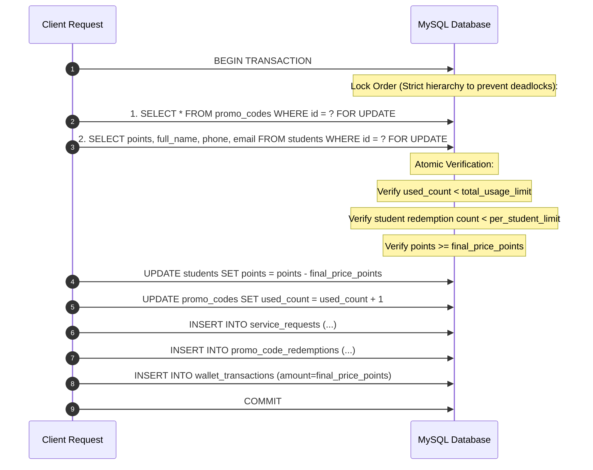
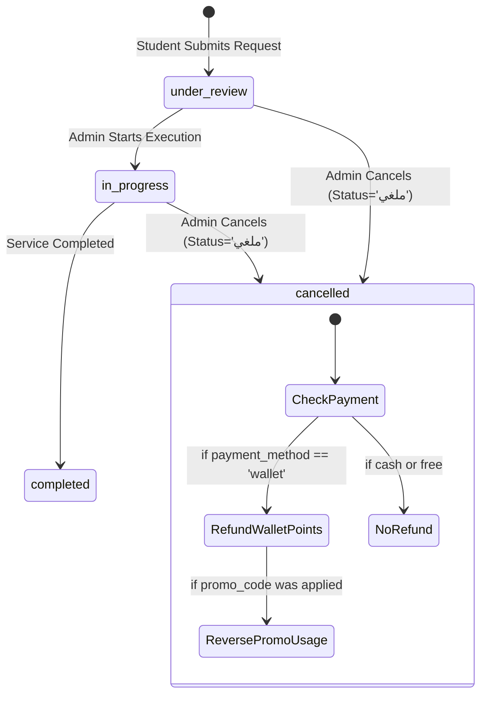

# Verified Phase 6A Implementation Plan — Promo Codes & Discounts (Revised)

*(Audit-Backed Architectural Specification, Concurrency Engine & Implementation Roadmap)*

> **⛔ Status: PHASE 6A PLAN REVISED — CASH PRICING AND CANCELLATION POLICY REQUIRE USER DECISION — NO IMPLEMENTATION STARTED**
> 
> | Phase | Description | Status |
> |---|---|---|
> | Phase 1 | Foundation, Auth, Apartments | `COMPLETED / VERIFIED / USER ACCEPTED ✅` |
> | Phase 2 | Districts & Universities | `COMPLETED / VERIFIED / USER ACCEPTED ✅` |
> | Phase 3 | Services & Service Requests | `COMPLETED / VERIFIED / USER ACCEPTED ✅` |
> | Phase 4 | Reviews Moderation, Feedback, Students & Points | `COMPLETED / VERIFIED / USER ACCEPTED ✅` |
> | Phase 5 | News, Notifications, Customer Support Chats | `COMPLETED / VERIFIED / USER ACCEPTED ✅` |
> | Phase 6 | Executive Dashboard & Cross-Module Analytics | `COMPLETED / VERIFIED / USER ACCEPTED ✅` |
> | **Phase 6A** | **Promo Codes & Discounts System** | **REVISED SPECIFICATION / WAITING FOR APPROVAL** |
> | Deferred | Housing Offers (Waiting for User Requirements) | `DEFERRED / FROZEN` |
> | Cutover | Phase 7 / Production Promotion | `NOT STARTED — REQUIRES EXPLICIT USER GO` |

---

## 1. Confirmed Business Decisions & Retractions

### A. Resolution on Cash Orders: Promo Codes Apply to Wallet Points Only
Following the codebase audit and confirmed business directive:
1. **Retraction:** All prior proposals suggesting percentage or fixed discounts "apply cleanly" to cash orders are **formally retracted**.
2. **Authoritative Rule:** **Promo codes apply exclusively to wallet payments (`payment_method = 'wallet'`).**
3. **No Cash Conversions:** We do not invent cash pricing columns, currency models, or points-to-cash exchange rates.
4. **Backend Enforcement:** If a request submits a `promo_code` with `payment_method = 'cash'`, the backend strictly rejects the request with HTTP 400 Bad Request and error code `PROMO_WALLET_ONLY` (Arabic: `كود الخصم متاح عند الدفع بنقاط المحفظة فقط`, English: `Promo codes are available for wallet points payments only`).
5. **Flutter UI Rule:** The Promo Code input field is enabled only when "Wallet Points" is selected. Switching from Wallet to Cash immediately clears any applied promo code and resets the price breakdown.
6. **Zero Impact on Ordinary Cash Orders:** Cash requests submitted without promo codes continue to function completely unchanged with zero regressions.

---

## 2. Verified Current-State Audit (with Exact Line References)

### A. Flutter Student Service Request Screen
- **File:** [`lib/screens/services_screen.dart`](file:///c:/Users/moham/Desktop/absher/lib/screens/services_screen.dart#L180-L710)
  - Line 189: `final promoCtrl = TextEditingController();`
  - Lines 481–490: Static, unvalidated text field.
  - Lines 642–657: Formats promo code into free-text `details` string (`\n[كود الخصم: XYZ]`).
  - Lines 690–705: Dispatches `ApiService.submitServiceRequest` without passing `promo_code` as a discrete field.

### B. Mobile API Service Layer
- **File:** [`lib/services/api_service.dart`](file:///c:/Users/moham/Desktop/absher/lib/services/api_service.dart#L523-L576)
  - `submitServiceRequest` sends `POST` to `$baseUrl/student_requests.php` with `action: 'submit'`.
  - No `validate_promo` endpoint currently exists.

### C. Backend Request Reception & Pricing
- **File:** [`backend_php/api_staging/student_requests.php`](file:///c:/Users/moham/Desktop/absher/backend_php/api_staging/student_requests.php#L285-L475)
  - Line 293: Resolves service price strictly from `services.price_points`.
  - Line 352: `SELECT points FROM students WHERE id = ? FOR UPDATE` locks student balance.
  - Line 364: `UPDATE students SET points = points - ? WHERE id = ? AND points >= ?` deducts 100% of points.
  - Line 375: Inserts row into `service_requests` (`service_price_points`, `points_charged`).
  - Line 383: Inserts audit row into `wallet_transactions` (`amount`, `type = 'خصم'`).

### D. Existing Admin Delete Behavior Audit
- **File:** [`backend_php/api_staging/admin_api.php`](file:///c:/Users/moham/Desktop/absher/backend_php/api_staging/admin_api.php)
  - Line 519 (`delete_service`): Executes hard delete `DELETE FROM services WHERE id = ?`.
  - Line 900 (`delete_student`): Executes hard delete `DELETE FROM students WHERE id = ?`.
  - **Audit Finding & Danger:** Hard foreign keys with `ON DELETE RESTRICT` on `student_id` or `service_id` in redemptions would cause `delete_student` and `delete_service` to fail with MySQL errno 1451.
  - **Architectural Solution:** Use `ON DELETE SET NULL` on relational foreign keys while saving complete immutable snapshot strings (`student_name_snapshot`, `student_phone_snapshot`, `student_email_snapshot`, `service_title_snapshot`, `request_id_snapshot`).

---

## 3. Database Schema & Staged Migration Plan

### Staged Migration Script: `sql/migrations/2026_08_phase6a_promo_codes.sql`
Following repository migration conventions (idempotent `information_schema` dynamic SQL):

```sql
-- Migration: Phase 6A Promo Codes & Discounts
-- Target: absher_georgia_staging ONLY (Production isolated)

SET @dbname = DATABASE();

-- 1. Main Promo Codes Table
CREATE TABLE IF NOT EXISTS `promo_codes` (
  `id` INT AUTO_INCREMENT PRIMARY KEY,
  `campaign_name` VARCHAR(255) NOT NULL,
  `code` VARCHAR(50) COLLATE utf8mb4_bin NOT NULL,
  `discount_type` ENUM('percentage', 'fixed', 'free') NOT NULL,
  `discount_value` DECIMAL(10, 2) NOT NULL DEFAULT 0.00,
  `max_discount_points` INT NULL DEFAULT NULL,
  `min_service_price_points` INT NOT NULL DEFAULT 0,
  `start_at` DATETIME NULL DEFAULT NULL,
  `expires_at` DATETIME NULL DEFAULT NULL,
  `status` ENUM('active', 'paused', 'archived') NOT NULL DEFAULT 'active',
  `service_scope` ENUM('all', 'selected') NOT NULL DEFAULT 'all',
  `audience_scope` ENUM('all', 'selected') NOT NULL DEFAULT 'all',
  `total_usage_limit` INT NULL DEFAULT NULL,
  `per_student_limit` INT NOT NULL DEFAULT 1,
  `used_count` INT NOT NULL DEFAULT 0,
  `created_at` DATETIME DEFAULT CURRENT_TIMESTAMP,
  `updated_at` DATETIME DEFAULT CURRENT_TIMESTAMP ON UPDATE CURRENT_TIMESTAMP,
  UNIQUE KEY `uq_promo_code` (`code`),
  INDEX `idx_promo_status_dates` (`status`, `start_at`, `expires_at`)
) ENGINE=InnoDB DEFAULT CHARSET=utf8mb4 COLLATE=utf8mb4_unicode_ci;

-- 2. Promo Code Service Eligibility Junction Table
CREATE TABLE IF NOT EXISTS `promo_code_services` (
  `id` INT AUTO_INCREMENT PRIMARY KEY,
  `promo_code_id` INT NOT NULL,
  `service_id` INT NOT NULL,
  `created_at` DATETIME DEFAULT CURRENT_TIMESTAMP,
  UNIQUE KEY `uq_promo_service` (`promo_code_id`, `service_id`),
  CONSTRAINT `fk_pcs_promo` FOREIGN KEY (`promo_code_id`) REFERENCES `promo_codes` (`id`) ON DELETE CASCADE,
  CONSTRAINT `fk_pcs_service` FOREIGN KEY (`service_id`) REFERENCES `services` (`id`) ON DELETE CASCADE
) ENGINE=InnoDB DEFAULT CHARSET=utf8mb4 COLLATE=utf8mb4_unicode_ci;

-- 3. Promo Code Student Audience Junction Table
CREATE TABLE IF NOT EXISTS `promo_code_students` (
  `id` INT AUTO_INCREMENT PRIMARY KEY,
  `promo_code_id` INT NOT NULL,
  `student_id` INT NOT NULL,
  `created_at` DATETIME DEFAULT CURRENT_TIMESTAMP,
  UNIQUE KEY `uq_promo_student` (`promo_code_id`, `student_id`),
  CONSTRAINT `fk_pcst_promo` FOREIGN KEY (`promo_code_id`) REFERENCES `promo_codes` (`id`) ON DELETE CASCADE,
  CONSTRAINT `fk_pcst_student` FOREIGN KEY (`student_id`) REFERENCES `students` (`id`) ON DELETE CASCADE
) ENGINE=InnoDB DEFAULT CHARSET=utf8mb4 COLLATE=utf8mb4_unicode_ci;

-- 4. Immutable Redemption History Table (Deletion-Safe Audit Trail)
CREATE TABLE IF NOT EXISTS `promo_code_redemptions` (
  `id` INT AUTO_INCREMENT PRIMARY KEY,
  `promo_code_id` INT NOT NULL,
  `service_request_id` INT NULL,
  `request_id_snapshot` INT NOT NULL,
  `student_id` INT NULL,
  `student_name_snapshot` VARCHAR(150) NOT NULL,
  `student_phone_snapshot` VARCHAR(50) NOT NULL,
  `student_email_snapshot` VARCHAR(150) NOT NULL,
  `service_id` INT NULL,
  `service_title_snapshot` VARCHAR(200) NOT NULL,
  `code_snapshot` VARCHAR(50) NOT NULL,
  `campaign_snapshot` VARCHAR(255) NOT NULL,
  `discount_type_snapshot` VARCHAR(20) NOT NULL,
  `discount_value_snapshot` DECIMAL(10, 2) NOT NULL,
  `original_price_points` INT NOT NULL,
  `discount_points` INT NOT NULL,
  `final_price_points` INT NOT NULL,
  `payment_method` VARCHAR(30) NOT NULL DEFAULT 'wallet',
  `status` ENUM('applied', 'reversed') NOT NULL DEFAULT 'applied',
  `reversed_at` DATETIME NULL DEFAULT NULL,
  `reversed_reason` VARCHAR(255) NULL DEFAULT NULL,
  `created_at` DATETIME DEFAULT CURRENT_TIMESTAMP,
  UNIQUE KEY `uq_redemption_request` (`service_request_id`),
  INDEX `idx_redemption_promo_student` (`promo_code_id`, `student_id`),
  INDEX `idx_redemption_student` (`student_id`, `created_at`),
  CONSTRAINT `fk_pcr_promo` FOREIGN KEY (`promo_code_id`) REFERENCES `promo_codes` (`id`) ON DELETE RESTRICT,
  CONSTRAINT `fk_pcr_request` FOREIGN KEY (`service_request_id`) REFERENCES `service_requests` (`id`) ON DELETE SET NULL,
  CONSTRAINT `fk_pcr_student` FOREIGN KEY (`student_id`) REFERENCES `students` (`id`) ON DELETE SET NULL,
  CONSTRAINT `fk_pcr_service` FOREIGN KEY (`service_id`) REFERENCES `services` (`id`) ON DELETE SET NULL
) ENGINE=InnoDB DEFAULT CHARSET=utf8mb4 COLLATE=utf8mb4_unicode_ci;

-- 5. Staged Extension of service_requests Table
-- Step 5a: Add columns as nullable first
SET @col1 = (SELECT COUNT(*) FROM information_schema.COLUMNS WHERE TABLE_SCHEMA = @dbname AND TABLE_NAME = 'service_requests' AND COLUMN_NAME = 'promo_code_id');
SET @sql1 = IF(@col1 = 0, 'ALTER TABLE service_requests ADD COLUMN promo_code_id INT NULL AFTER service_id', 'SELECT 1');
PREPARE stmt1 FROM @sql1; EXECUTE stmt1; DEALLOCATE PREPARE stmt1;

SET @col2 = (SELECT COUNT(*) FROM information_schema.COLUMNS WHERE TABLE_SCHEMA = @dbname AND TABLE_NAME = 'service_requests' AND COLUMN_NAME = 'discount_points');
SET @sql2 = IF(@col2 = 0, 'ALTER TABLE service_requests ADD COLUMN discount_points INT NULL AFTER service_price_points', 'SELECT 1');
PREPARE stmt2 FROM @sql2; EXECUTE stmt2; DEALLOCATE PREPARE stmt2;

SET @col3 = (SELECT COUNT(*) FROM information_schema.COLUMNS WHERE TABLE_SCHEMA = @dbname AND TABLE_NAME = 'service_requests' AND COLUMN_NAME = 'final_price_points');
SET @sql3 = IF(@col3 = 0, 'ALTER TABLE service_requests ADD COLUMN final_price_points INT NULL AFTER discount_points', 'SELECT 1');
PREPARE stmt3 FROM @sql3; EXECUTE stmt3; DEALLOCATE PREPARE stmt3;

-- Step 5b: Backfill legacy historical rows accurately
-- For wallet payments: final_price_points = points_charged (or service_price_points), discount_points = 0
UPDATE service_requests 
SET discount_points = 0,
    final_price_points = COALESCE(points_charged, service_price_points, 0)
WHERE final_price_points IS NULL AND payment_method = 'wallet';

-- For cash & free payments: final_price_points = 0, discount_points = 0
UPDATE service_requests 
SET discount_points = 0,
    final_price_points = 0
WHERE final_price_points IS NULL;

-- Step 5c: Apply NOT NULL constraints and foreign key safely
ALTER TABLE `service_requests`
  MODIFY COLUMN `discount_points` INT NOT NULL DEFAULT 0,
  MODIFY COLUMN `final_price_points` INT NOT NULL DEFAULT 0;

SET @fk_exists = (SELECT COUNT(*) FROM information_schema.TABLE_CONSTRAINTS WHERE TABLE_SCHEMA = @dbname AND TABLE_NAME = 'service_requests' AND CONSTRAINT_NAME = 'fk_sr_promo');
SET @sql_fk = IF(@fk_exists = 0, 'ALTER TABLE service_requests ADD CONSTRAINT fk_sr_promo FOREIGN KEY (promo_code_id) REFERENCES promo_codes (id) ON DELETE SET NULL', 'SELECT 1');
PREPARE stmt_fk FROM @sql_fk; EXECUTE stmt_fk; DEALLOCATE PREPARE stmt_fk;
```

---

## 4. Exact Discount Arithmetic & Validation Rules

### A. Code Normalization & Format
- **Normalization:** Code is converted to `trim(strtoupper($code))` on client and server.
- **Regex Validation:** `/^[A-Z0-9_-]{3,50}$/` (3 to 50 uppercase alphanumeric characters, dashes, and underscores).

### B. Mathematical Calculation Rules
1. **Percentage Discount (`discount_type = 'percentage'`):**
   - Value Range: `1 <= discount_value <= 100`.
   - Raw Calculation: `$rawDiscount = $originalPricePoints * ($discountValue / 100.0)`.
   - Rounding: `$discountPoints = (int)floor($rawDiscount)` (deterministic integer points).
   - Max Cap Rule: If `$maxDiscountPoints !== null && $maxDiscountPoints > 0`, `$discountPoints = min($discountPoints, $maxDiscountPoints)`.
   - Bound Check: `$finalPricePoints = max(0, $originalPricePoints - $discountPoints)`.
2. **Fixed Points Discount (`discount_type = 'fixed'`):**
   - Value Range: `1 <= discount_value <= 100000` (integer points).
   - `$discountPoints = min((int)$discountValue, $originalPricePoints)`.
   - `$finalPricePoints = max(0, $originalPricePoints - $discountPoints)`.
3. **Free Service Code (`discount_type = 'free'`):**
   - `$discountPoints = $originalPricePoints`.
   - `$finalPricePoints = 0`.
   - Wallet deduction = `0`.
4. **General Guardrails:**
   - Zero-value discounts are prohibited during code creation.
   - `min_service_price_points`: If `$originalPricePoints < $minServicePricePoints`, validation fails with `MIN_PRICE_NOT_MET`.
   - Date validation: `start_at <= expires_at`.
   - `used_count` is maintained transactionally and protected from becoming negative via `GREATEST(0, used_count - 1)`.

---

## 5. Strict API Contracts & Error Protocols

### A. Student Validation: `POST /api_staging/services/validate_promo.php`
- **Authentication:** **Strictly Required Bearer JWT**. Unauthenticated requests return HTTP 401. `student_id` is extracted strictly from the verified JWT payload (`JWT::decode($token)['student_id']`). Never accept a client-supplied ID.
- **Request Payload:**
  ```json
  {
    "code": "SUMMER20",
    "service_id": 3,
    "payment_method": "wallet"
  }
  ```
- **Responses:**
  - **Success (HTTP 200):**
    ```json
    {
      "status": "success",
      "data": {
        "is_valid": true,
        "promo_code_id": 4,
        "code": "SUMMER20",
        "campaign_name": "خصم الصيف للطلاب",
        "discount_type": "percentage",
        "discount_value": 20.0,
        "original_price": 100,
        "discount_points": 20,
        "final_price": 80,
        "message": "تم تطبيق كود الخصم بنجاح (-20 نقطة)"
      }
    }
    ```
  - **Business Rule Rejection (HTTP 400):**
    ```json
    {
      "status": "error",
      "error_code": "PROMO_WALLET_ONLY",
      "message": "كود الخصم متاح عند الدفع بنقاط المحفظة فقط"
    }
    ```
  - **Error Code Catalog:**
    - `UNAUTHORIZED` (HTTP 401)
    - `INVALID_CODE` (HTTP 400)
    - `PROMO_WALLET_ONLY` (HTTP 400)
    - `DISABLED` (HTTP 400)
    - `NOT_STARTED` (HTTP 400)
    - `EXPIRED` (HTTP 400)
    - `TOTAL_LIMIT_REACHED` (HTTP 400)
    - `STUDENT_LIMIT_REACHED` (HTTP 400)
    - `SERVICE_NOT_ELIGIBLE` (HTTP 400)
    - `MIN_PRICE_NOT_MET` (HTTP 400)
    - `ACCOUNT_BLOCKED` (HTTP 403)

### B. Student Request Submission: `POST /api_staging/student_requests.php` (action=submit)
- Revalidates the promo code **inside the atomic transaction** regardless of prior validation.
- Removes bracketed `[كود الخصم: XYZ]` concatenation from `details`. Stores `promo_code_id`, `discount_points`, `final_price_points` structurally.

### C. Admin Endpoints: `POST /api_staging/admin_api.php`
- `action=add_promo_code`
- `action=update_promo_code` (If `used_count > 0`, the `code` string is locked/immutable)
- `action=toggle_promo_code_status` (`active` <-> `paused`)
- `action=archive_promo_code` (`status = 'archived'`)
- `action=get_promo_redemptions` (Paged redemption audit log for a specific code)

---

## 6. Concurrency Engine & Deadlock Prevention



---

## 7. Request Cancellation & Refund State Machine (Open Policy Decision)

### Current Code Flow
In [`backend_php/api_staging/admin_api.php`](file:///c:/Users/moham/Desktop/absher/backend_php/api_staging/admin_api.php#L663-L710), request status is updated via `action=update_request_status` (`جديد` -> `قيد المراجعة` -> `قيد التنفيذ` -> `مكتمل` -> `ملغي`).

### Proposed State Machine & Open Options



> [!WARNING]
> ### Open Decision Required: Cancellation Refund Automation
> We present two distinct policies for user approval before coding:
> - **Option A (Automatic):** When Admin changes status to `ملغي` (`Cancelled`), the backend automatically refunds `final_price_points` to the student wallet, reverses the redemption (`status = 'reversed'`), and decrements `promo_codes.used_count` by 1.
> - **Option B (Explicit Action):** Changing status to `ملغي` only marks the record. Refunding points and reversing promo usage requires an explicit separate Admin action/button to prevent unwanted automatic point crediting.

---

## 8. Executive Dashboard Integration

To display Promo Code KPIs on the Executive Dashboard without degrading performance:
- **Backend API:** [`backend_php/api_staging/admin/dashboard.php`](file:///c:/Users/moham/Desktop/absher/backend_php/api_staging/admin/dashboard.php)
  - Adds lightweight aggregation query:
    ```sql
    SELECT 
      (SELECT COUNT(*) FROM promo_codes WHERE status = 'active') AS active_promos,
      (SELECT COUNT(*) FROM promo_code_redemptions WHERE status = 'applied') AS total_redemptions,
      (SELECT COALESCE(SUM(discount_points), 0) FROM promo_code_redemptions WHERE status = 'applied') AS total_points_saved;
    ```
- **React Admin:**
  - Update [`admin_react/src/types/dashboard.ts`](file:///c:/Users/moham/Desktop/absher/admin_react/src/types/dashboard.ts) to include `promo_stats`.
  - Update [`admin_react/src/hooks/useDashboardStats.ts`](file:///c:/Users/moham/Desktop/absher/admin_react/src/hooks/useDashboardStats.ts).
  - Update [`admin_react/src/modules/dashboard/DashboardModule.tsx`](file:///c:/Users/moham/Desktop/absher/admin_react/src/modules/dashboard/DashboardModule.tsx) with a compact KPI card consistent with existing metrics.
  - Full redemption arrays are **never returned in `get_all`**; they are loaded on-demand via `action=get_promo_redemptions&promo_id=X`.

---

## 9. Updated Table Inventory (20 Physical Tables)

| # | Table Name | Domain / Purpose | Status / Migration Phase |
|---|---|---|---|
| 1 | `admins` | Admin credentials & JWT auth | Phase 1 ✅ |
| 2 | `apartments` | Apartments listings | Phase 1 ✅ |
| 3 | `districts` | Reference districts list | Phase 2 ✅ |
| 4 | `universities` | Reference universities list | Phase 2 ✅ |
| 5 | `services` | Student services catalog | Phase 3 ✅ |
| 6 | `service_requests` | Student booking requests (extended with promo snapshot) | Phase 3 ✅ / Phase 6A |
| 7 | `service_reviews` | Student ratings & testimonials | Phase 4 ✅ |
| 8 | `application_feedback` | User suggestions & bug reports | Phase 4 ✅ |
| 9 | `students` | Student accounts & profiles | Phase 4 ✅ |
| 10 | `blocked_identities` | Persistent blocked identities | Phase 4 ✅ |
| 11 | `wallet_transactions` | Points & wallet audit trail | Phase 4 ✅ |
| 12 | `news` | Georgia & student news | Phase 5 ✅ |
| 13 | `notifications` | Push broadcast notifications | Phase 5 ✅ |
| 14 | `chats` | Student support conversations | Phase 5 ✅ |
| 15 | `chat_messages` | Chat messages & media | Phase 5 ✅ |
| 16 | `housing_offers` | Exclusive housing discounts | **`DEFERRED / FROZEN`** |
| 17 | **`promo_codes`** | **Promo campaigns & discount rules** | **Phase 6A** |
| 18 | **`promo_code_services`** | **Service-specific promo eligibility** | **Phase 6A** |
| 19 | **`promo_code_students`** | **Student audience promo eligibility** | **Phase 6A** |
| 20 | **`promo_code_redemptions`**| **Immutable redemption snapshot & audit** | **Phase 6A** |

---

## 10. Comprehensive Verification Matrix (35 Automated Tests)

1. `test_valid_percentage_discount`: 20% on 100 pt service -> 80 pts charged.
2. `test_percentage_with_max_cap`: 50% capped at 30 pts on 100 pt service -> 70 pts charged.
3. `test_valid_fixed_discount`: 25 pt discount on 100 pt service -> 75 pts charged.
4. `test_fixed_discount_exceeds_price`: 150 pt discount on 100 pt service -> 0 pts charged (never negative).
5. `test_free_service_code`: Free code -> 0 pts charged, 0 wallet deduction, wallet request path.
6. `test_cash_request_with_promo_rejected`: Cash + promo -> 400 Bad Request `PROMO_WALLET_ONLY`.
7. `test_cash_request_without_promo_success`: Ordinary cash request -> 200 OK, unchanged behavior.
8. `test_validate_endpoint_unauthorized`: Validation without JWT token -> 401 Unauthorized.
9. `test_validate_endpoint_blocked_student`: Validation by blocked student -> 403 Forbidden.
10. `test_code_trimming_and_uppercase`: Inputs like ` summer20 ` correctly matched as `SUMMER20`.
11. `test_invalid_code_string`: Non-existent code -> 400 `INVALID_CODE`.
12. `test_paused_code`: Paused code -> 400 `DISABLED`.
13. `test_future_scheduled_code`: Code before `start_at` -> 400 `NOT_STARTED`.
14. `test_expired_code`: Code after `expires_at` -> 400 `EXPIRED`.
15. `test_service_scope_selected_allowed`: Code for Service A applied to Service A -> 200 OK.
16. `test_service_scope_selected_rejected`: Code for Service A applied to Service B -> 400 `SERVICE_NOT_ELIGIBLE`.
17. `test_audience_scope_selected_allowed`: Private code applied by authorized student -> 200 OK.
18. `test_audience_scope_selected_rejected`: Private code applied by unlisted student -> 400 `INVALID_CODE` (privacy guard).
19. `test_min_service_price_rule`: Code requiring 150 pts on 100 pt service -> 400 `MIN_PRICE_NOT_MET`.
20. `test_total_usage_limit_exhausted`: 11th redemption attempt on code with limit 10 -> 400 `TOTAL_LIMIT_REACHED`.
21. `test_per_student_limit_exhausted`: 2nd redemption attempt by same student on limit 1 -> 400 `STUDENT_LIMIT_REACHED`.
22. `test_concurrent_final_global_usage`: 2 concurrent requests for last available use -> exactly 1 succeeds, 1 fails.
23. `test_concurrent_per_student_limit`: 2 concurrent requests for same student -> exactly 1 succeeds.
24. `test_wallet_exact_deduction`: Student balance deducted by exactly `final_price_points`.
25. `test_idempotent_request_uuid_replay`: Submitting same `request_uuid` returns identical cached response without double deduction or double redemption.
26. `test_code_immutability_after_use`: Attempt to change `code` string when `used_count > 0` is rejected.
27. `test_student_deletion_preserves_redemptions`: Hard deleting student sets `student_id = NULL` in redemptions, leaving snapshot strings intact.
28. `test_service_deletion_preserves_redemptions`: Hard deleting service sets `service_id = NULL` in redemptions, leaving snapshot strings intact.
29. `test_request_deletion_preserves_redemptions`: Deleting request sets `service_request_id = NULL`, leaving redemption snapshot intact.
30. `test_reversal_decrements_used_count`: Cancellation decrements `used_count` and marks redemption `status = 'reversed'`.
31. `test_duplicate_reversal_protection`: Reversing an already reversed redemption is idempotent and does not double decrement.
32. `test_legacy_request_backfill`: Verifies existing historical rows have `final_price_points` correctly backfilled.
33. `test_dashboard_lightweight_query`: Verifies `dashboard.php` metrics query runs in < 5ms without returning large array lists.
34. `test_transaction_rollback_on_failure`: Simulated failure during request insert rolls back wallet points and promo usage count.
35. `test_production_isolation`: Verifies `absher_georgia_db` is 100% untouched.

---

## 11. Staging and Production Safety Confirmation

- **Development & Staging Only:** All migrations, endpoints, and UI will be deployed to Staging (`absher_georgia_staging`, `/api_staging/`, `/admin_v2/`).
- **Production Isolation:** Production (`/admin/`, `/api/`, `absher_georgia_db`, mobile app production build) will remain **100% untouched**.
- **Cutover (Phase 7):** Halted until complete Phase 6A implementation is verified and accepted by user.
